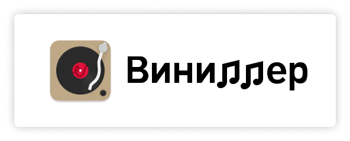
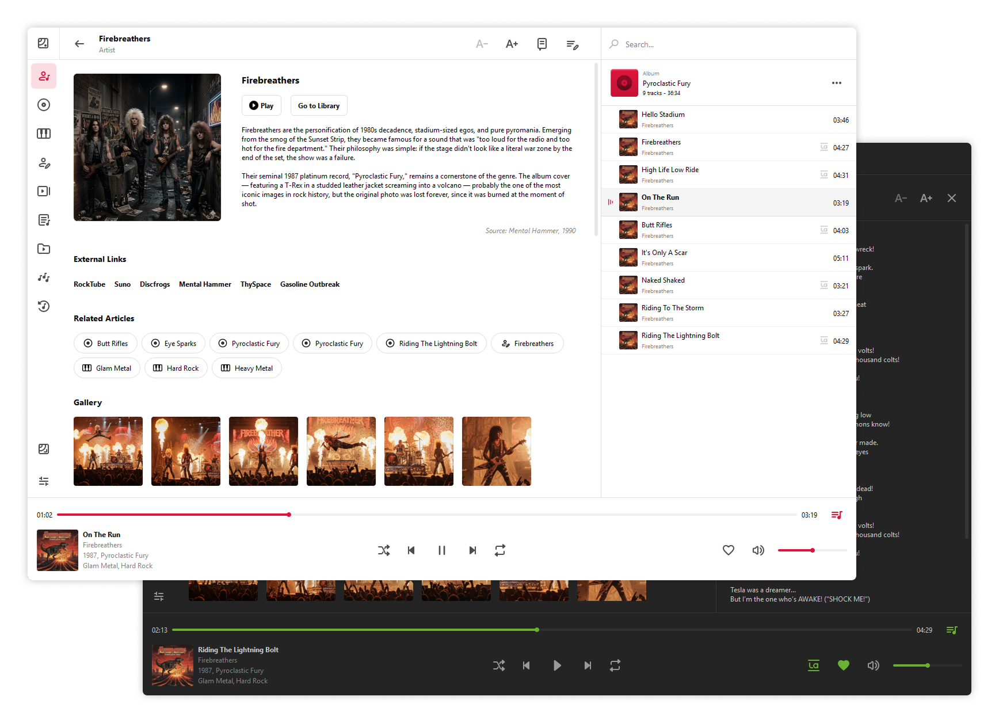
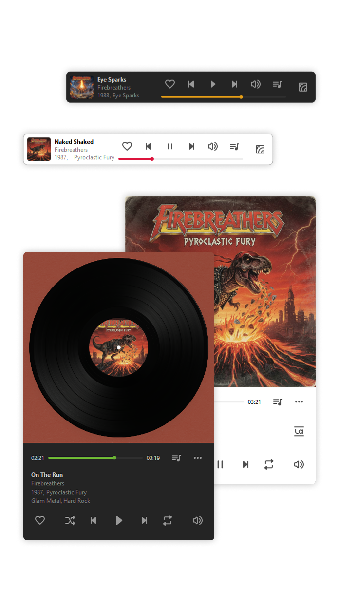

<div align="center">


`PYTHON 3.13+` `PYQT6` `GPL-3.0+`

**[English](README.md) | [Русский](README.ru.md)**

</div>

---

# Vinyller


Виниллер — это современный кроссплатформенный проигрыватель для локальной коллекции музыки с поддержкой всех 
основных аудиоформатов и возможностью чтения по трекам монолитных FLAC+CUE альбомов. 
Проигрыватель позволяет гибко настроить интерфейс, легко организовать фонотеку с помощью встроенного редактора тегов 
и создания собственной музыкальной энциклопедии. 


|                                      Темы оформления                                       |                                                 Статья энциклопедии                                                  |                                          Режимы окна                                          |
|:------------------------------------------------------------------------------------------:|:--------------------------------------------------------------------------------------------------------------------:|:---------------------------------------------------------------------------------------------:|
| [](docs/assets/vinyller_main_themes.png)  | [](docs/assets/vinyller_encyclopedia_lyrics_view.png)  | [](docs/assets/vinyller_compact_modes.png) | 


## Основные возможности

<details>
<summary><b>Управление фонотекой и редактор тегов</b></summary>

Виниллер позволяет редактировать метаданные композиций и альбомов, не выходя из программы, чтобы вы могли поддерживать свою фонотеку в порядке. А для удобного управления фонотекой доступны поиск, сортировка, учет артиклей в названиях исполнителей и альбомов, возможность группировать жанры без учета регистра и многое другое!

</details>

<details>
<summary><b>Избранное и черный список</b></summary>

Добавляйте в избранное композиции, альбомы, исполнителей, композиторов, жанры, списки воспроизведения и папки — как в стриминговых сервисах, только у себя, локально. Также можно добавлять в черный список музыку, которую не хочется видеть в фонотеке, но удалять — рука не поднимается.

</details>

<details>
<summary><b>Музыкальная энциклопедия</b></summary>

Пишите обзоры и рецензии, добавляйте фотографии с концертов, связывайте статьи о музыкантах между собой и добавляйте ссылки на внешние ресурсы — будь то официальный сайт или магазин по продаже пластинок.

</details>

<details>
<summary><b>Рейтинг и чарты</b></summary>

Вы наверняка знаете, что чаще всего слушали в этом месяце, но как насчет целого года? Или наоборот — какой из альбомов покрылся толстым слоем пыли? Включайте чарты и собирайте собственную статистику! 

**Важно:** Статистика формируется [локально](docs/MANUAL.ru.md#хранение-пользовательских-данных) и хранится только на вашем устройстве!

</details>

<details>
<summary><b>Режимы окна проигрывателя</b></summary>

- Обычный — для полного управления фонотекой и воспроизведением; 
- Виниловый — компактный режим, стилизованный под воспроизведение пластинки; 
- Мини — сверхкомпактный плеер в режиме «Поверх всех окон».

</details>

<details>
<summary><b>Темы и стилизация</b></summary>

Стилизуйте внешний вид обложек альбомов под старые конверты для пластинок и добавьте звучанию характерное потрескивание. Нравятся темные темы? Виниллер поддерживает разные темы оформления, а также возможность тонкой настройки акцентного цвета. 

</details>

<details>
<summary><b>Формирование микстейпов</b></summary>

Создавайте сборники песен в пару кликов — автоматический экспорт в отдельную папку, чтобы поделиться своей музыкой с друзьями. Больше никакого ручного копирования файлов по одному!

</details>

<details>
<summary><b>А ещё...</b></summary>

- История воспроизведения и восстановление позиции воспроизведения последней прослушанной композиции при перезапуске;
- Быстрый переход на внешние ресурсы из контекстного меню композиций, альбомов, исполнителей, композиторов и жанров, а также добавление собственных источников поиска информации;
- Поиск и просмотр текстов песен, а также поиск композиций по словам из текстов песен;
- Перетаскивание музыки в плеер и быстрый экспорт композиций из очереди воспроизведения;
- Разные виды отображения карточек альбомов;
- И многое другое! Подробный список доступен в [руководстве пользователя](docs/MANUAL.ru.md).

</details>


**Поддерживаемые форматы:** .mp3, .flac, .ogg, .wav, .m4a, .mp4, .wma, .aac, а также виртуальное разделение FLAC+CUE альбомов на треки.

Виниллер доступен на 18 языках и поддерживает легкое [добавление новых локализаций](docs/MANUAL.ru.md#добавление-новых-локализаций).

---

## Руководство пользователя
В документации подробно описаны возможности проигрывателя, методы взаимодействия, описание функций энциклопедии и редактора метаданных, а также логика формирования чартов и инструкция по добавлению новых файлов переводов:
[Руководство пользователя](docs/MANUAL.ru.md).

## О приватности и сетевой активности
Виниллер — это приложение, ориентированное на локальную работу и уважающее приватность. Проигрыватель **не собирает телеметрию, не требует 
создания учетных записей и не отправляет данные о вашей фонотеке или истории прослушиваний на сторонние серверы**. 
Подробнее в [Руководстве пользователя](docs/MANUAL.ru.md#приватность-и-сетевая-активность).

---

## Скачать последние выпуски

| Платформа   | Формат    | Ссылка                                                                                                                                                                                                                                               |
|-------------|-----------|------------------------------------------------------------------------------------------------------------------------------------------------------------------------------------------------------------------------------------------------------|
| **macOS**   | `.dmg`    | [Скачать для Apple Silicon](https://github.com/maxcreations/vinyller/releases/latest/download/Vinyller_macOS_Apple_Silicon.dmg)<br/>[Скачать для Intel](https://github.com/maxcreations/vinyller/releases/latest/download/Vinyller_macOS_Intel.dmg)  |
| **Windows** | `.exe`    | [Скачать установщик](https://github.com/maxcreations/vinyller/releases/latest/download/Vinyller_Windows_Setup.exe)<br/>[Портативная версия](https://github.com/maxcreations/vinyller/releases/latest/download/Vinyller_Portable.exe)                 |
| **Linux**   | `.tar.gz` | [Обычная версия](https://github.com/maxcreations/vinyller/releases/latest/download/Vinyller_Linux.tar.gz)                                                                                                                                            |
**Минимальные системные требования:** Двухъядерный процессор, 4 Гб ОЗУ. 
**Поддерживаемые ОС:** Windows 10/11, macOS 14+, Ubuntu 22.04+

---

## Быстрый старт
<details>
<summary><b>Запуск проекта из исходного кода</b></summary>

1. Клонируйте репозиторий:
   ```bash
   git clone https://github.com/maxcreations/vinyller.git
   cd vinyller
   ```
2. Установите зависимости:
   ```bash
   pip install -r requirements.txt
   ```
3. Запустите Виниллер:
   ```bash
   python vinyller.py
   ```
</details>

## Быстрая сборка PyInstaller

<details>
<summary><b>macOS</b></summary>

```
pyinstaller --noconfirm --name Vinyller --onedir --windowed --icon="assets/logo/app_icon.png" --add-data "assets:assets" --add-data "translations:translations" --add-data "LICENSE:." --osx-bundle-identifier "ru.maxcreations.vinyller" vinyller.py
```
    
</details>

<details>
<summary><b>Windows</b></summary>

#### А. Для обычного режима:
```
pyinstaller --noconfirm --name Vinyller --onedir --noconsole --version-file="version_info.txt" --add-data "assets;assets" --icon="assets/logo/app_icon_win.ico" --add-data "translations;translations" --add-data "LICENSE;." vinyller.py
```
#### Б. Для портативного режима:
```
pyinstaller --noconfirm --onefile --noconsole --version-file="version_info.txt" --add-data "assets;assets" --icon="assets/logo/app_icon_win.ico" --add-data "translations;translations" --add-data "LICENSE;." --name Vinyller_Portable vinyller.py
```
</details>

<details>
<summary><b>Linux</b></summary>

```
pyinstaller --noconfirm --name Vinyller --onedir --noconsole --add-data "assets:assets" --icon="assets/logo/app_icon.png" --add-data "translations:translations" --add-data "LICENSE:." vinyller.py
```
</details>

---

## Roadmap

- [ ] **Доработки Linux:** исправить потенциальные проблемы с размером шрифта.
- [ ] **Работа с метаданными:** добавить поиск и автозаполнение метаданных на основе базы MusicBrainz.
- [ ] **Унификация тем оформления:** провести рефакторинг стилей для создания удобных инструментов генерации пользовательских тем.
- [ ] **Магические числа:** провести рефакторинг и вынести все жёстко заданные числа, не связанные с дизайном, в отдельный файл.
- [ ] **Общий рефакторинг:** провести общую оптимизацию кода для соответствия MVC.

---

## Благодарности
### Библиотеки с открытым кодом
- [PyQt6](https://pypi.org/project/PyQt6) — Python Bindings для Qt;
- [Mutagen](https://github.com/quodlibet/mutagen) — для работы с метаданными аудио;
- [Pillow](https://github.com/python-pillow/Pillow) — библиотека для работы с изображениями;
- [Requests](https://github.com/psf/requests) — для загрузки текстов песен и описаний для статей энциклопедии;
- [Send2Trash](https://github.com/arsenetar/send2trash) — для отправки файлов в корзину, вместо моментального удаления;
- [urllib3](https://github.com/urllib3/urllib3) — для обработки внешних ссылок и данных Википедии;
- [PyObjC](https://pyobjc.readthedocs.io/) — для интеграции с нативными медиа-кнопками на macOS и MPRemoteCommandCenter.

### Внешние сервисы
- [Apple Music](https://music.apple.com) — поиск метаданных и обложек;
- [LRCLIB](https://lrclib.net) — поиск текстов песен;
- [Wikipedia](https://www.wikipedia.org/) — поиск кратких описаний для статей энциклопедии.

### Ребятам, которые тестировали ранние версии
**TuneLow** и **StarSwarschik**, а также всем, кто задавал вопросы, которые позволили сделать Виниллер лучше.

### Использование ИИ
Сложные функции, методы и переводы на разные языки были реализованы с поддержкой ИИ.

---

## Правовая информация

**Vinyller (Виниллер)** — © 2026 [Maxim Moshkin](mailto:hellomaxcreations@gmail.com).

Данное программное обеспечение распространяется на условиях лицензии **GNU General Public License v3.0 or later**.
Полный текст лицензии доступен в файле [LICENSE](LICENSE).

**Отказ от ответственности (Disclaimer):**
Программное обеспечение предоставляется «КАК ЕСТЬ» (AS IS), без каких-либо явных или подразумеваемых гарантий. Разработчик не несет ответственности за потерю данных (включая удаление файлов фонотеки, некорректное перезаписывание метаданных аудиофайлов), прерывание работы или любой другой ущерб, возникший в результате использования или невозможности использования данного программного обеспечения. Рекомендуется делать резервные копии вашей фонотеки и файлов энциклопедии перед массовым редактированием метаданных.
