

**User Manual**

**[English](MANUAL.en.md) | [Русский](MANUAL.ru.md)**

---

# Table of contents

* [Table of contents](#table-of-contents)
* [About](#about)
  * [Legal Information](#legal-information)
* [First Launch](#first-launch)
* [Main Features](#main-features)
  * [User Data Storage](#user-data-storage)
  * [Privacy and Network Activity](#privacy-and-network-activity)
  * [Supported Audio Formats](#supported-audio-formats)
  * [Music Center](#music-center)
    * ["My Wave" Section](#my-wave-section)
    * [How the "My Wave" Playback Queue is Generated](#how-the-my-wave-playback-queue-is-generated)
    * [Adding Music to Favorites](#adding-music-to-favorites)
    * [Unavailable Favorites](#unavailable-favorites)
    * [Top Tracks List](#top-tracks-list)
  * [Main Tabs](#main-tabs)
    * [Navigation and Control](#navigation-and-control)
    * [Artists, Albums, Genres, and Composers](#artists-albums-genres-and-composers)
    * [All tracks](#all-tracks)
    * [Playlists](#playlists)
    * [Folders](#folders)
  * [Library Search](#library-search)
    * [Search Modes](#search-modes)
    * [Displaying Results and Navigation](#displaying-results-and-navigation)
    * [Quick Actions](#quick-actions)
  * [Charts and Rating](#charts-and-rating)
    * [Charts Tab](#charts-tab)
    * [Rating Generation](#rating-generation)
    * [Generating the Charts Archive](#generating-the-charts-archive)
  * [Playback history](#playback-history)
* [Player Control and Actions](#player-control-and-actions)
  * [Playback control panel](#playback-control-panel)
    * [Track Information](#track-information)
    * [Controls](#controls)
    * [Additional Tools](#additional-tools)
  * [Playback Queue](#playback-queue)
    * [Queue Header](#queue-header)
    * [List Management](#list-management)
    * [Additional Actions](#additional-actions)
    * [Viewing Lyrics](#viewing-lyrics)
  * [Context Menu and Actions](#context-menu-and-actions)
    * [Core Actions](#core-actions)
    * [Changing Artist, Composer, or Genre Cover](#changing-artist-composer-or-genre-cover)
    * [Creating Mixtapes](#creating-mixtapes)
    * [Quick Track Export](#quick-track-export)
    * [Search Services](#search-services)
    * [Drag and Drop into the Program Window](#drag-and-drop-into-the-program-window)
  * [Player Window Modes](#player-window-modes)
    * [Main mode](#main-mode)
    * [Vinyl mode](#vinyl-mode)
    * [Mini mode](#mini-mode)
  * [Application Hotkeys](#application-hotkeys)
    * [Playback Control](#playback-control)
    * [Sound and Mode Control](#sound-and-mode-control)
    * [Navigation and Interface](#navigation-and-interface)
* [Metadata and Encyclopedia](#metadata-and-encyclopedia)
  * [Metadata Editor](#metadata-editor)
    * [Single Track Editor Mode](#single-track-editor-mode)
    * [Edit Album Metadata Mode](#edit-album-metadata-mode)
    * [Edit Multiple Files Metadata Mode](#edit-multiple-files-metadata-mode)
    * [Search on Apple Music Integration](#search-on-apple-music-integration)
    * [Saving Changes](#saving-changes)
  * [Encyclopedia](#encyclopedia)
    * [Encyclopedia Manager Window](#encyclopedia-manager-window)
    * [Adding and Editing an Article](#adding-and-editing-an-article)
    * [Viewing an Article](#viewing-an-article)
    * [Import, Export and Encyclopedia Backups](#import-export-and-encyclopedia-backups)
* [Settings and Processes](#settings-and-processes)
  * [Settings](#settings)
    * [General settings](#general-settings)
    * [Preferences](#preferences)
    * [Library](#library)
    * [Charts and Rating](#charts-and-rating-1)
    * [Encyclopedia](#encyclopedia-1)
    * [Search Services](#search-services-1)
  * [Processes](#processes)
    * [Updating the Library](#updating-the-library)
    * [Startup Library Modification Check](#startup-library-modification-check)
    * [Splitting Albums into Discs](#splitting-albums-into-discs)
    * [Parsing Monolithic FLAC+CUE Albums](#parsing-monolithic-flaccue-albums)
    * [Caching External Tracks](#caching-external-tracks)
  * [Adding New Localizations](#adding-new-localizations)
    * [Requirements](#requirements)
    * [Tools](#tools)
    * [Procedure](#procedure)

# About

[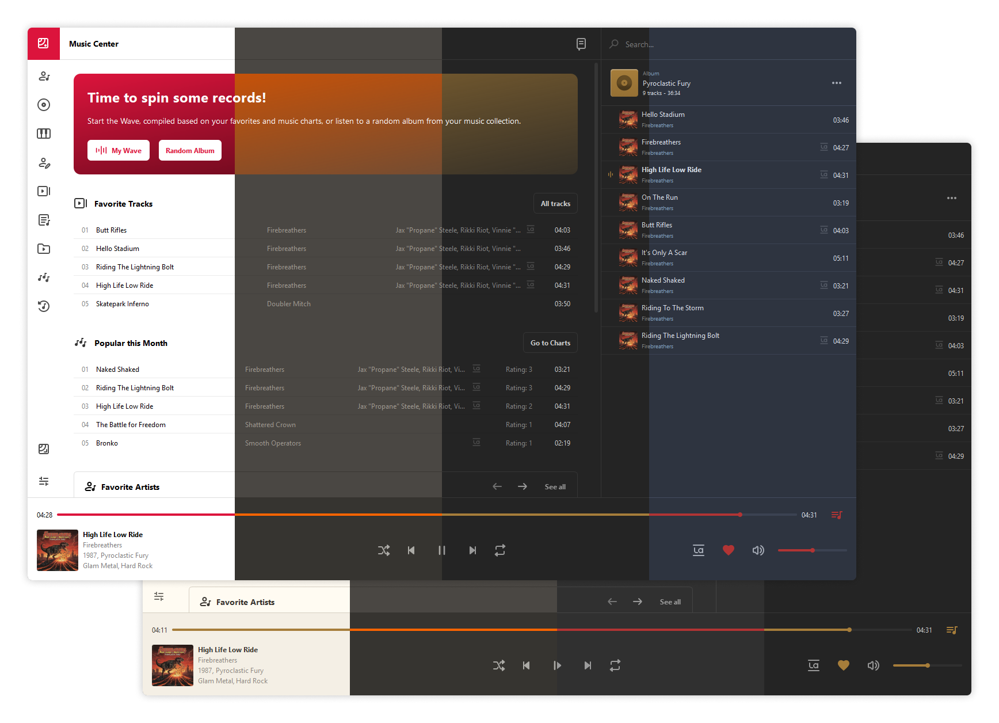](assets/vinyller_main_themes.png)

Vinyller is a modern cross-platform player for local music collections, supporting all major audio formats and the ability to read monolithic FLAC+CUE albums track-by-track. The player allows you to flexibly customize the interface and easily organize your library using the built-in metadata editor and by creating your own music encyclopedia. 

The player supports modern Windows, macOS, and Linux operating systems. Minimum system requirements are a dual-core processor and 4 GB of RAM.

Visit the official page: [Vinyller on GitHub](https://www.github.com/maxcreations/vinyller).

## Legal Information

**Vinyller** — © 2026 [Maxim Moshkin](mailto:hellomaxcreations@gmail.com).

This software is distributed under the **GNU General Public License v3.0 or later**.
The full text of the license is available in the [LICENSE](../LICENSE) file.

**Disclaimer:**
The software is provided "AS IS", without warranty of any kind, express or implied. The developer is not responsible for data loss (including the deletion of library files, incorrect overwriting of audio metadata), interruptions of work, or any other damage arising from the use or inability to use this software. It is recommended to make backups of your library and encyclopedia files before mass metadata editing.
This manual may be updated or changed alongside the project's development.

---

# First Launch
This section covers how to launch Vinyller and add music to your library.

1. Upon the first launch, Vinyller will prompt you to select the interface language.
2. Once the player window appears, you need to add your music folders to it. You can do this in several ways:
   - Using the folder selection button;
   - By dragging and dropping music files or folders into the program window;
   - In the settings window under the "Library" tab.
3. Once the scanning of the added files is complete, Vinyller is ready to go!

| Language Selection | Main Window | Adding Music | "Folders" Tab | Settings Window |
|---------------------------------------------------------------------------------------------|----------------------------------------------------------------------------------------------------------------------|-------------------------------------------------------------------------------------------------|---------------------------------------------------------------------------------------------------|---------------------------------------------------------------------------------------------|
| [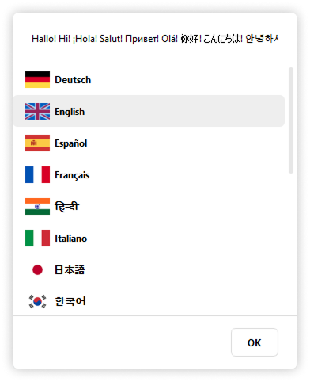](assets/first_start/start_language.png) | [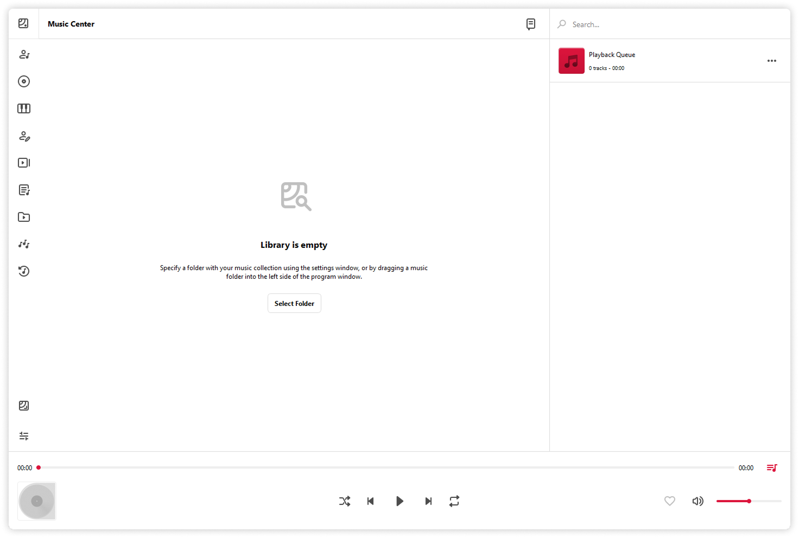](assets/first_start/start_main_wnd.png)                          | [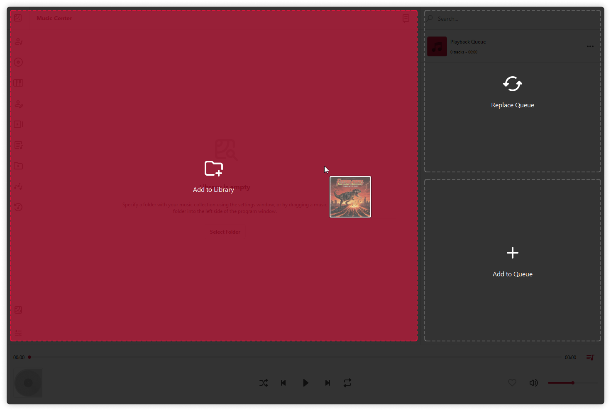](assets/first_start/start_dragndrop.png)   | [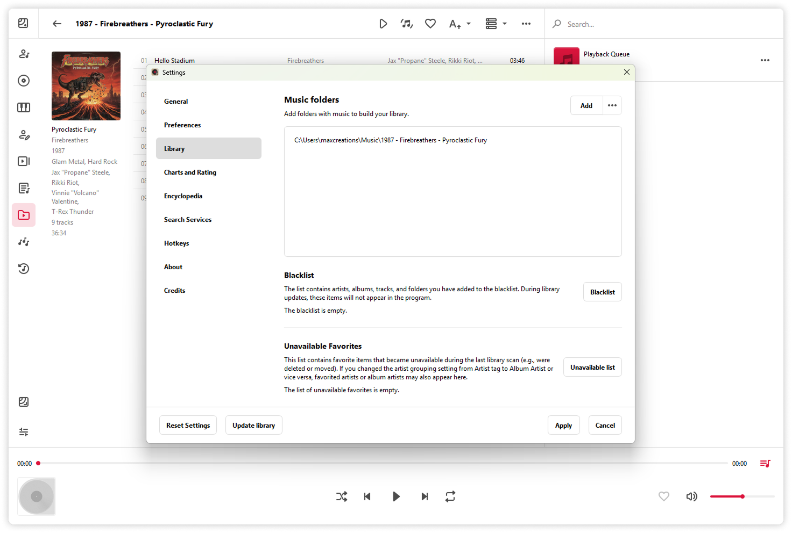](assets/first_start/start_folder_view.png) |  |
| Select a language | Add music using the button or by dragging a file or folder into the corresponding area in the program window | The process of dragging music into the program | The player will automatically redirect to the added folder | You can add and remove music folders in the program settings window | 

# Main Features

This section describes the main features of the Vinyller player.

## User Data Storage
All user files are stored and processed **locally**. 
The files are located in the `.vinyller` folder (`VINYLLER_FOLDER`) in the user's home directory, for example, `C:\\Users\\user_name\\.vinyller`. 

This directory may contain:
- **Player files** — settings;
- **Library files** — cache and album covers; lists for favorites, blacklist, and "unavailable favorites"; data on pending library updates;
- **Encyclopedia files** — the encyclopedia text data, encyclopedia images, and automatic backups;
- **Statistics files** — lists containing track ratings;
- **History files** — playback history list; data about the last viewed page and the playback queue;
- **Search Services files** — a list of search services added by the user and a list of disabled default quick search services;
- **Temporary files** — files created dynamically before final saving into the main player data.

The list of files may change depending on the player's settings (e.g., disabling statistics collection or playback history) and may expand in the future alongside the player's development.

## Privacy and Network Activity

Vinyller is an application focused on local operation that respects your privacy. The player **does not collect telemetry, requires no account creation, and does not send data about your library or listening history to third-party servers**. 

The application's network activity is strictly limited to metadata fetching functions and is initiated only when using the respective tools. Below is a detailed description of what data is sent and where:

- **Apple Music (iTunes Search API)**
  - **Where it's used:** In the built-in [Metadata Editor](#metadata-editor) to search for covers and tracklists.
  - **What is sent:** When clicking the search button, the player sends only the text from the query string (e.g., *"Artist Name Album Title"*) to the public server `itunes.apple.com`. When loading a tracklist, only the digital album identifier (`collectionId`) is sent. No data about your local files is transmitted.
- **LRCLIB (Lyrics)**
  - **Where it's used:** In the [Metadata Editor](#metadata-editor) for downloading song lyrics.
  - **What is sent:** The player queries the public `lrclib.net` API and transmits the following tags of the requested track: **Artist**, **Title**, **Album**, and **Duration** in seconds. This data is necessary for accurate lyrics retrieval.
- **Wikipedia**
  - **Where it's used:** In the [Music Encyclopedia](#encyclopedia) to automatically fill article descriptions and download the main article image.
  - **What is sent:** When initiating a search, only the text search query (article title) and the selected language are sent to retrieve the introductory article text and the URL of the main image. The image is downloaded directly via a public link.
- **Search Services**
  - **Where it's used:** When selecting the "Search Online..." option in the [Context Menu](#context-menu-and-actions), or clicking the search button in the [Metadata Editor](#metadata-editor), and when editing an [Encyclopedia](#encyclopedia) article.
  - **How it works:** Vinyller **does not** make network requests itself in this mode. The program merely constructs a text URL (for example, injecting the artist's name into a Spotify or Google URL) and passes a command to your operating system to open this link in your default browser.
- **GitHub API (Application Update Check)**
  - **Where it is used:** At player startup (if the corresponding option is enabled in the [settings](#general-settings)) to check for new versions of the program.
  - **What is sent:** A standard anonymous GET request is made to the public GitHub API (`api.github.com/repos/maxcreations/vinyller/releases/latest`). The player receives only the latest version number and a link to the release. No data about your system, library, or settings is transmitted.

**Cover Art Downloads:** All images (both for the encyclopedia and the library) are downloaded via direct URLs using standard HTTP requests and saved to your local directory.

## Supported Audio Formats
.mp3, .flac, .ogg, .wav, .m4a, .mp4, .wma, .aac, as well as [virtual splitting of FLAC+CUE](#parsing-monolithic-flaccue-albums) albums into individual tracks.

## Music Center

[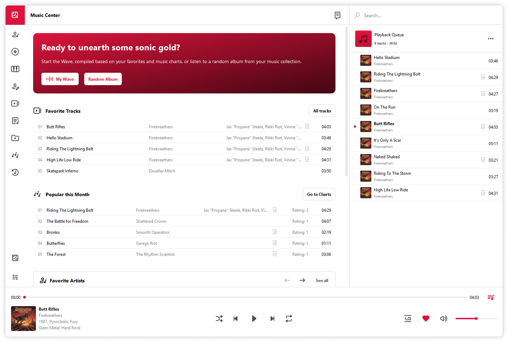](assets/favorites/favorites_music_center.png)

The Music Center serves as the primary tab where your favorite tracks, albums, artists, composers, playlists, and folders are gathered. 

### "My Wave" Section
In the main block of the Music Center, you'll find the "My Wave" and "Random Album" buttons.

- The "My Wave" button generates a playback queue of random tracks based on the music added to your favorites and the rating of your listening history (if statistics collection is enabled).
- The "Random Album" button starts playing a random album from your entire library.

### How the "My Wave" Playback Queue is Generated

The algorithm for generating the smart **"My Wave"** queue is based on a weighted random selection system that prioritizes your musical preferences. 

1. **Preference Collection:** The app loads your favorite lists (favorite tracks, artists, albums, and genres).
2. **Candidate Pool Creation:** To avoid freezing on massive libraries, a limited pool of tracks is randomly selected from the entire database for analysis. The pool size is governed by the `MY_WAVE_SAMPLE_POOL_SIZE` constant (default is 2000).
3. **Weight Assignment (Scoring):** Each track in the pool is initially given a base chance of entering the queue — `MY_WAVE_BASE_SCORE` (default is 1). The weight is then increased if there are matches with your favorites:
   - The track itself is in favorites: adds `MY_WAVE_BONUS_FAV_TRACK` (+50)
   - The track's artist is in favorites: adds `MY_WAVE_BONUS_FAV_ARTIST` (+30)
   - The track's album is in favorites: adds `MY_WAVE_BONUS_FAV_ALBUM` (+20)
   - One of the track's genres is in favorites: adds `MY_WAVE_BONUS_FAV_GENRE` (+15, awarded once)
4. **Weighted Sampling:** Tracks are selected from the scored pool. The probability of a specific track being chosen depends directly on its total weight. To ensure enough tracks remain after filtering, the algorithm selects items with a buffer, multiplying the desired limit by `MY_WAVE_OVERSAMPLE_MULTIPLIER`.
5. **Filtering and Limits:** The algorithm clears the selection of duplicates, leaving only unique entries. The process stops when the queue is filled to the limit defined in `MY_WAVE_DEFAULT_LIMIT` (default is 50 tracks).

### Adding Music to Favorites
To add a track, album, artist, composer, playlist, or folder to your favorites, you can use several methods:
- **[Context Menu](#context-menu-and-actions)** — Right-click on the desired entity to open the context menu and select "Add to Favorites";
- **Playback control panel** — Click the favorite icon (default is <kbd>♥</kbd>) to add the currently playing track to your favorites list;
- **Current page toolbar** — Click the favorite icon (default is <kbd>♥</kbd>) in the top panel of the open page to add the currently viewed entity (album, artist, composer, genre, playlist, or folder) to your favorites list;

Removing items from the favorites list is done by reversing the action, i.e., clicking the respective button or menu item again.

### Unavailable Favorites

[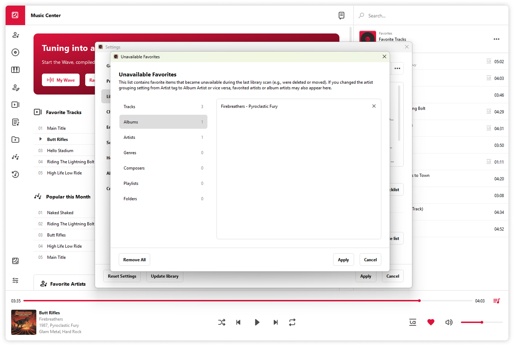](assets/favorites/favorites_settings_unavailable_wnd.png)

If, for any reason, items added to the favorites list become unavailable (due to moving or deleting files, transferring user settings files between devices, disconnecting a drive, etc.), then:
- The items are hidden from the "Music Center" tab interface and go into the "Unavailable Favorites" list, which can be managed in the player's **[Settings](#settings)** under the **"Library"** tab.
- When access to the files is restored (provided the paths match exactly) and the player is restarted, the unavailable list will be automatically cleared, and the items will be restored to the "Music Center" tab.

### Top Tracks List
If the [playback rating](#charts-and-rating) option is enabled, this tab will also display a "Popular this Month" block containing a short list of your frequently played tracks.

---

## Main Tabs

Vinyller automatically organizes and catalogs your added music into several categories, forming the following main tabs:
- Artists;
- Albums;
- Genres;
- Composers;
- All tracks;
- Playlists;
- Folders.

The order of the tabs in the side navigation bar can be changed in the [Settings](#settings) under the Preferences section.

| Tab Root Page, "Tile" View | Artist Albums, "Grid" View | Artist Albums, "All tracks" View | Single Album |
|---------------------------------------------------------------------------------------------------|-----------------------------------------------------------------------------------------------------------------|-------------------------------------------------------------------------------------------------------------------------------|---------------------------------------------------------------------------------------------------|
| [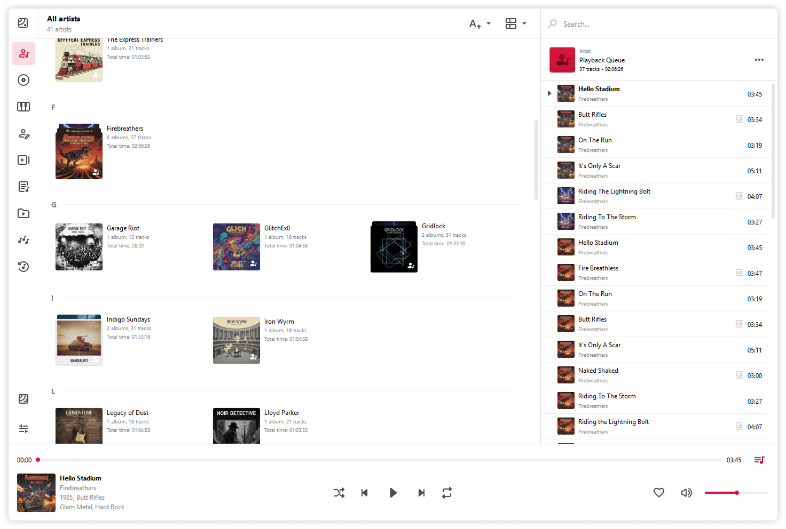](assets/main_wnd/vinyller_artists.png) | [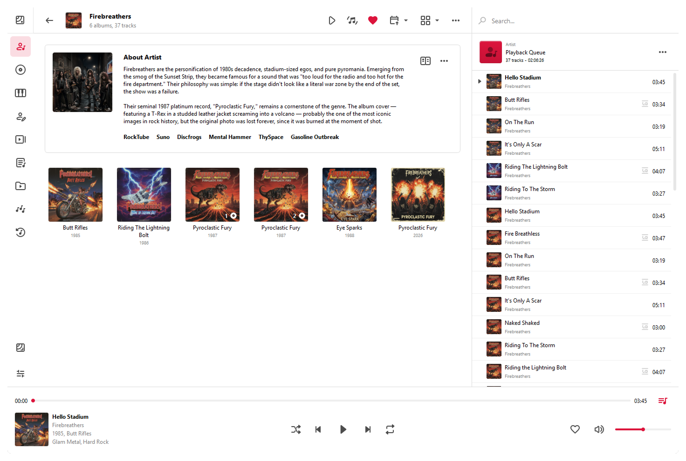](assets/main_wnd/vinyller_artist_albums_grid.png) | [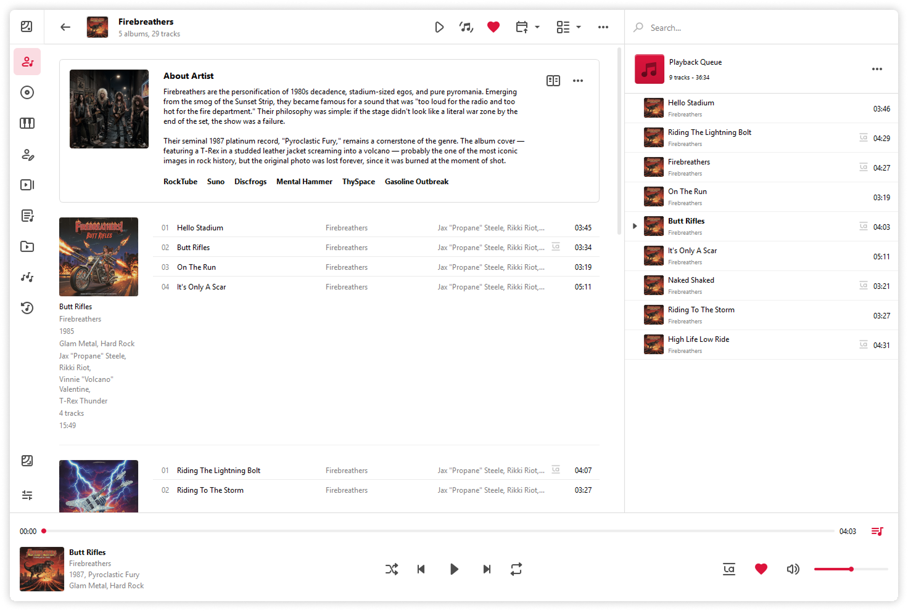](assets/main_wnd/vinyller_artist_albums_all_tracks.png) | [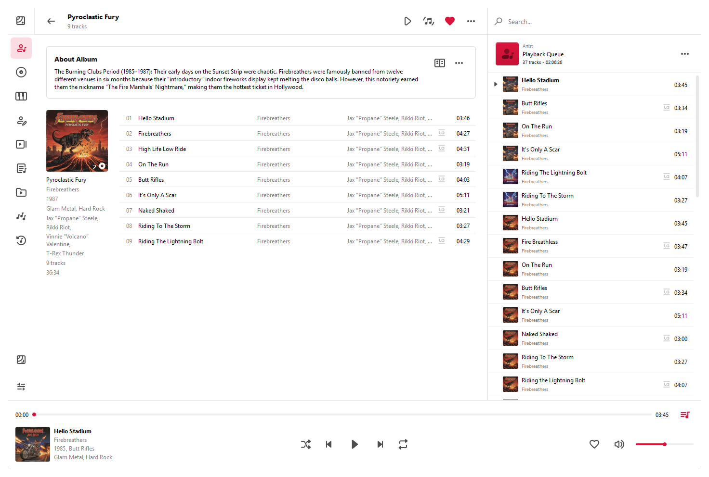](assets/main_wnd/vinyller_artist_single_album.png) | 

### Navigation and Control
- **Grouping and Quick Navigation:** If **navigation separators** are enabled in the settings, the cards on the root tab pages will be visually divided into logical blocks depending on the selected sorting mode (by initial letter for alphabetical sorting, by year for release year sorting, or by month for date added sorting). Clicking such a separator opens a **quick navigation menu** jumping to other separators on the page.
- **Random Suggestions:** If there are 20 or more items on a tab and the corresponding setting is enabled, a recommendation block may appear at the top of the tabs featuring a random selection of items to listen to.
- **Quick Play:** Clicking the interactive play button overlay on a card instantly starts playback of the selected entity.
- **Navigating to Inner Pages:** Clicking on an artist, composer, genre, or folder card opens a list of albums for that entity. Clicking an album card opens a detailed page with a tracklist, from which you can play the entire release or individual tracks.
- **<kbd>←</kbd> (Back) Button:** allows you to go one step back within each tab independently.

Depending on the context, page control panels may contain:
- **Sort Options:** allows you to organize items by various criteria (alphabetical, release year, date added, etc., depending on context).
- **View Options:** allows you to toggle the display style of items on the page (Grid, Tile, Small Tile, and in the case of viewing artists, composers, and folders — album cards with a tracklist).
- **Actions:** allows you to add to favorites, play, etc., the currently viewed entity.
- **Special buttons:** jump to the encyclopedia manager window or a detailed article.

### Artists, Albums, Genres, and Composers
In these sections, the library is grouped based on the corresponding audio file metadata.
- **Artists:** Grouping is based on the `album artist` or `artist` tag. The grouping behavior can be changed in the [Settings](#settings) under the Preferences tab. Your choice determines how you navigate through artists.
- **Albums:** This tab aggregates all albums in your library.
- **Genres:** Segregates music by musical styles.
- **Composers:** If a composer is specified in the track metadata, they will automatically appear on this tab (useful for classical music or soundtracks, as well as finding authors of popular songs).

### All tracks
A dedicated section to view your entire music database as lists, divided into groups (alphabetically or by periods depending on sorting).
- At the top of the page is a **quick navigation panel** to jump between groups.
- Tracks are grouped into cards corresponding to their albums.

### Playlists
If playlist files (e.g., `.m3u` or `.m3u8` formats) are present in the user's system music folder (e.g., `C:\\Users\\user_name\\Music\\Playlists`), Vinyller will automatically index them and display them in this section.
- **Cover Generation:** If the music from the playlist is in your library, the playlist cards will generate a mini-cover from the first track in the list that has artwork.
- **Brief Information:** If the music from the playlist is in your library, the total number of tracks and the total duration will be displayed on the card.
- **Management:** Playlists can be played entirely or opened to view the contents and manage the track order via drag-and-drop.
- **Import to Library:** If the music from the playlist is NOT in your library, you can select the action from the playlist's context menu to import the music folders contained within that playlist.

#### Creating Playlists and Adding Music
To create a playlist or add tracks to one, the following actions are available:
- **From a track's context menu:** you can add it to an existing playlist or create a new one (from the playback queue or the main player interface);
- **From the [Playback Queue's](#playback-queue) options menu:** you can save a new playlist consisting of the tracks currently in the queue.
- **By dragging and dropping:** a track from the playback queue can be dragged onto a playlist card or, if the playlist is open, dragged to the desired position in the list.

### Folders
This section is designed for users who prefer classic file system navigation over metadata sorting.
- The root page of the tab displays the root music directories you have added to the library.
- Deep navigation is supported: you can dive into subfolders exactly as you would in a system file explorer.
- Folders containing audio files will be displayed as album cards with a tracklist.
- Playing a folder via the "Play" button automatically gathers all supported audio files within it (including subfolders) and adds them to the playback queue.

---

## Library Search

[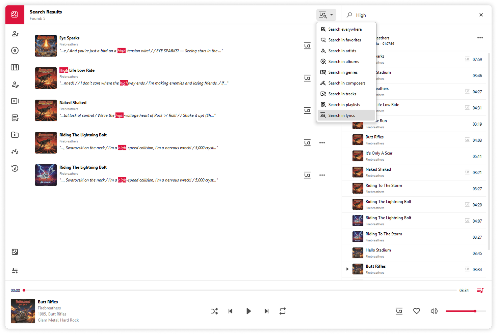](assets/main_wnd/vinyller_search_lyrics.png)

The global search bar, located at the top of the program window, allows you to instantly find music across your entire local database. Search works in real-time: results begin to appear as you type (with a slight delay to prevent stuttering), without needing to press the `Enter` key. If you clear the search bar, the player will hide the search results.

### Search Modes
Using a special filter button next to the search bar, you can narrow down the search scope by selecting a specific category:
- **Search everywhere:** Searches across all available metadata simultaneously (default).
- **Search in artists, Search in albums, Search in genres, Search in composers:** Targeted search only within the specified entities.
- **Search in tracks:** Searches and displays results as album cards containing the matching tracks.
- **Search in playlists:** Searches by the names of saved playlist files.
- **Search in favorites:** Searches only among items that are in your favorites list.
- **Search in lyrics:** A mode that looks for matches directly *inside the song lyrics* stored in the audio files' metadata. Search results will display special cards showing the exact lyric lines where the match was found.

### Displaying Results and Navigation
The search interface dynamically adapts to the type of data being queried:
- **View Options:** Depending on the selected search mode, results can be displayed as a list ("All tracks"), Grid, Tile, or Small Tile. You can switch views using the view button in the search panel.
- **Nested Navigation:** Clicking on a found artist, genre, or composer in the search results will open a detailed page with their albums directly inside the search tab. You can return to the main list of results using the <kbd>←</kbd> (Back) button.

### Quick Actions
When the search returns a list of tracks (or when searching "Search everywhere"), additional action buttons appear on the search control panel:
- **Play all:** Starts playback of all found results, replacing the current queue.
- **Shake and Play:** Physically shuffles the found results into a random order, adds them to the queue, and starts playback.

Any card or track in the search results supports the standard [Context Menu](#context-menu-and-actions) via right-click.

---

## Charts and Rating
This section describes the internal logic of processing playback statistics, the rules for awarding ratings, and the mechanisms for generating charts. The compiled statistics are processed and stored **locally only** within the `.vinyller` folder (`VINYLLER_FOLDER`) in the user directory.
- **Toggle charts:** In the settings window, you can enable or disable statistics collection. When disabled, the "Charts" button is hidden from the main menu.
- **Global Reset:** Accessed from settings, this allows you to wipe all history. You can choose to: delete only current statistics or clear them entirely along with the monthly archives.
- **Targeted Reset:** If the rating of a specific item is no longer relevant, you can zero it out via the context menu (right-click on a card or track). The player will offer a choice: "Reset month stats" or clear it entirely for "All Time".

### Charts Tab
The charts tab aggregates collected statistics and displays them through a system of cards and lists, divided into categories: Top Tracks, Top Albums, Top Artists, Top Genres, Top Composers, and the Charts Archive.

[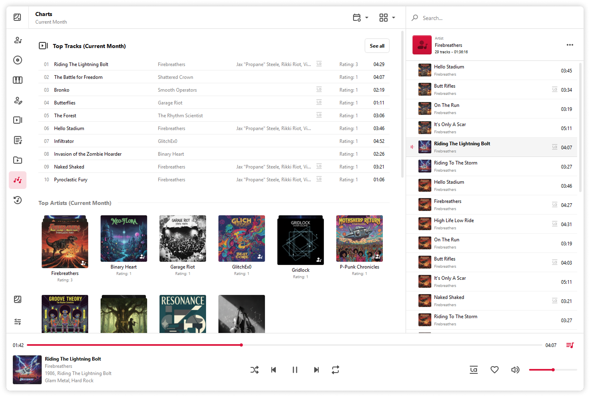](assets/charts/charts.png)

- **Time Period:** Using a dedicated button in the top control panel, you can toggle the data display between "Current Month" and "All Time" slices.
- **Sorting and Display:** When viewing a category in detail (via the "See all" button), items can be sorted by rating (highest/lowest), alphabetically (A-Z, Z-A), or by release year (for albums). Changing the view is also available: as a list, Tile, or Small Tile.

### Rating Generation

#### Rules for Counting Plays
For a play to be counted and for the item to receive rating points, the playback must satisfy a strict set of parameters. 
The algorithm (`PlaybackStatsHandler`) uses these rules to validate and protect against artificial boosting (e.g., rapidly skipping tracks):
- **Base Duration Threshold (`STATS_AWARD_PERCENTAGE`):** By default, a play is counted upon continuous playback of `0.5` (50%) of the track's total duration.
- **Absolute Minimum (`STATS_AWARD_MIN_S`):** Regardless of the percentage, a track must play for at least `15` seconds. If a track is shorter than `STATS_AWARD_MIN_S`, it will not receive a rating. This prevents musical interludes and other brief tracks from cluttering the chart statistics.
- **Cap for Long Tracks (`STATS_AWARD_CAP_S`):** An upper threshold is set for lengthy tracks (audiobooks, podcasts, etc.). A play is guaranteed to be counted after `240` seconds (4 minutes) of playback, even if that is less than 50% of the duration.

#### Point Distribution
Upon a valid play, the algorithm (`PlaybackStatsHandler`) distributes points among the track's metadata. 
To protect against artificial inflation (e.g., looping a single track), a cascading system with context checking is used:
- **Base Award:** The playing track unconditionally receives `+1` point for every valid play.
- **Conscious Choice (`conscious_choice_data`):** If playback is initiated intentionally from the page of a specific entity (album, artist, genre, composer), the algorithm awards it a bonus `+2` points. If a specific track was launched directly, it gets an additional `+1` point.
- **Album Boost Protection:** The associated album receives `+1` point **only if** it has changed compared to the previously played track (checking against `last_played`). This rule applies if the album **has not yet received** a conscious choice bonus.
- **Universal Artist Awarding:** The algorithm collects all unique participants of the track from all available tags (artist, album artist, guest artists from the `artists` tag). It calculates the difference between the artists of the current and previous track, and `+1` point is awarded only to **new** artists in this chain. This ensures fair accounting for all participating artists and prevents looping exploits.
- **Dynamic Tags (Genres and Composers):** Similar to artists, the algorithm calculates the difference between the tags of the current and previous track. Each **new** genre or composer receives `+1` point. This rule works continuously both during conscious launches and background playback in the general queue (provided the entity has not previously received a conscious choice bonus).

#### Background Statistics Saving
To optimize application performance and minimize disk I/O while listening to music, statistics are saved asynchronously:
- **Polling Interval (`STATS_POLL_INTERVAL_S`):** A background poller (timer) wakes up every `30` seconds and checks for new unsaved data. If the player is paused or stopped at that moment, the data is written to disk.
- **Force Save Interval (`STATS_SAVE_TRIGGER_INTERVAL_M`):** If music is playing continuously, saving cannot be delayed indefinitely. Therefore, accumulated data is automatically flushed to disk every `10` minutes.
- **Save on Close:** Upon a normal application close, Vinyller forces an immediate save of all statistics remaining in RAM.

### Generating the Charts Archive
[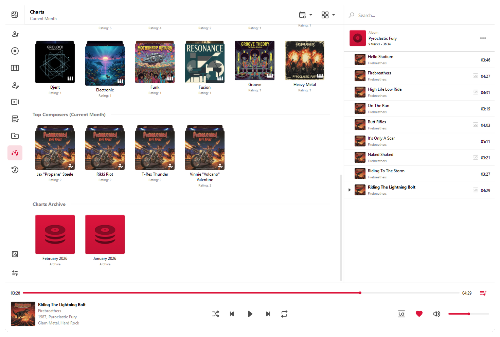](assets/charts/charts_archive.png)
The library manager algorithm `LibraryManager` automatically detects the change of a calendar month. At this moment, a summary is compiled:
* Vinyller takes the **Top 50** most popular items from each category and saves them into a special, immutable archive.
* Past months' records are available for viewing in a separate navigation block at the very bottom of the "Charts" tab.

---

## Playback history
The music playback history is located on a separate tab in the main navigation panel. 
In the program settings, you can choose the behavior of the playback history:
- **Do not remember history** — clears the playback history and hides the history tab;
- **Remember for current session** — stores playback history until the player is closed;
- **Remember last 1000 tracks** (`HISTORY_LIMIT`) — stores history between sessions for the last 1000 records. This option is enabled by default.

**Store only unique tracks in history**
An option is available in the settings to record only unique tracks in the history. If enabled, a previously played track will jump to the top of the list instead of being recorded multiple times.

**How does a track get into the history?**
A track will appear in the recent playback history tab `HISTORY_MIN_S` (default 5 seconds) after playback begins.

---

# Player Control and Actions

This section describes the main actions and methods available to control Vinyller's playback.

## Playback control panel
The playback control panel provides access to all primary music control functions and is located at the bottom of the window. The panel dynamically adapts to the selected interface mode (Main mode, Vinyl mode, Mini mode).

### Track Information
- **Cover Art:** Hovering the cursor over the cover art allows you to enlarge it for detailed viewing (the cover will open in the main player window).
- **Track Title:** If the title is too long, it is neatly truncated.
- **Artist, Album, Year, and Genres:** All these elements are clickable. Clicking on them provides a quick jump to the corresponding page in your library.
    * *Note:* If a track has multiple artists or genres specified, clicking on the selected element will open a drop-down menu allowing you to choose the specific artist or genre to navigate to. If grouping by "Album Artist" is enabled in settings, the jump will be made to the album artist without the option to select.

### Controls
- **Playback Progress Bar:** Displays the current time and total track duration. Allows quick seeking by clicking an area on the progress bar.
- **Navigation Buttons:** Previous track, Play/Pause, Next track.
- **Shuffle mode:** Enables random track playback order until the function is disabled. Unlike the `Shake and Play` function, it does not physically rearrange tracks in the playback queue.
- **Repeat mode:** Has three states — repeat off, repeat queue, repeat single track.

### Additional Tools
The right side of the panel houses tools for sound and interface control:
- **Lyrics <kbd>la</kbd>:** Switches the side playback queue panel into a lyrics view mode for the current song (the button is active only if lyrics are present in the file's metadata).
- **Add to favorites:** Quickly save the current track to your favorite tracks list.
- **Volume:** Includes a quick Mute button and a volume slider. 
  * *In "Vinyl mode", the volume is hidden in a compact pop-up that appears when clicking the speaker icon.*
- **Show Playback Queue / Hide Playback Queue:** Toggles the visibility of the right panel showing the current playback queue.
- **Options Menu ("..."):** Available in compact modes. Allows you to "Hide control panel", toggle "Always on top", or switch to Mini mode. Pinning the window "Always on top" on Linux OS (Wayland, etc.) is unavailable as the user handles window pinning manually.

---

## Playback Queue
The playback queue is located on a slide-out panel on the right and shows the list of tracks that will play next. The panel combines the functionality of managing the current queue list and viewing song lyrics.

[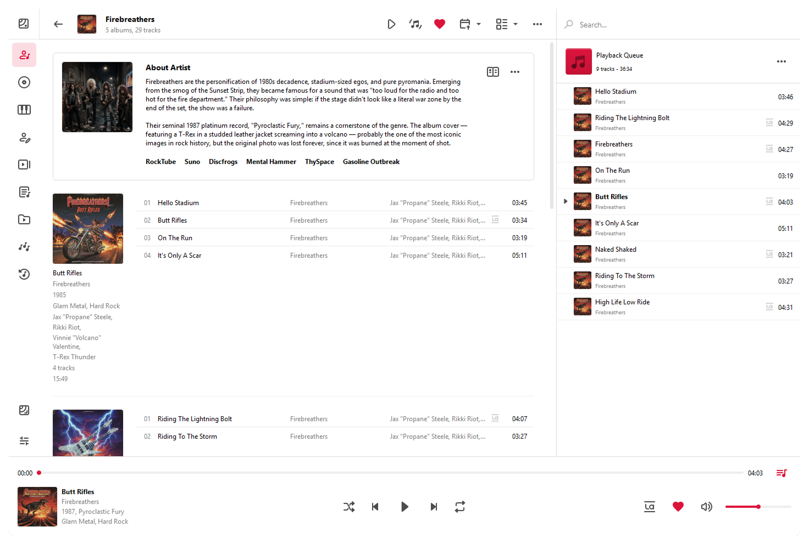](assets/main_wnd/vinyller_artist_albums.png)

### Queue Header
- **Source:** An icon and text hint indicate where the music is playing from (e.g., a specific album, playlist, folder, or "My Wave").
- **Statistics:** The total number of tracks in the queue and their total duration.

### List Management
- **Changing Order:** You can reorder tracks using simple Drag-and-Drop.
- **Quick Play:** Double-clicking any track will immediately begin playing it.
- **Context Menu:** Right-clicking a track opens the standard [action menu](#context-menu-and-actions) (add to favorites, go to artist, edit metadata, etc.).

### Additional Actions
In the queue header is a menu button (<kbd>...</kbd>) that opens the appearance and list management menu:
- **Compact List:** Reduces the row height of the track list to show more information on the screen.
    * *Hide Artist Name:* Available only in compact view. Leaves only the track titles.
- **Show Cover Art:** Enables or disables cover art thumbnails next to each track in the queue.
- **Autoplay on Add:** If this option is enabled, tracks added to the queue will automatically start playing (if playback was previously stopped).
- **Shake Queue:** Instantly shuffles all tracks in the current list into a random physical order. [*Not equivalent to the `Shuffle mode` function!*](#playback-control-panel)
- **Clear Queue:** Completely removes all tracks from the list.
- **Save as Playlist:** Allows you to save the current list of tracks from the queue into a standalone [playlist file](#playlists).
- **Create Mixtape:** Exports the current queue as a physical folder containing the files (see the ["Creating Mixtapes"](#creating-mixtapes) section for details).

### Viewing Lyrics

[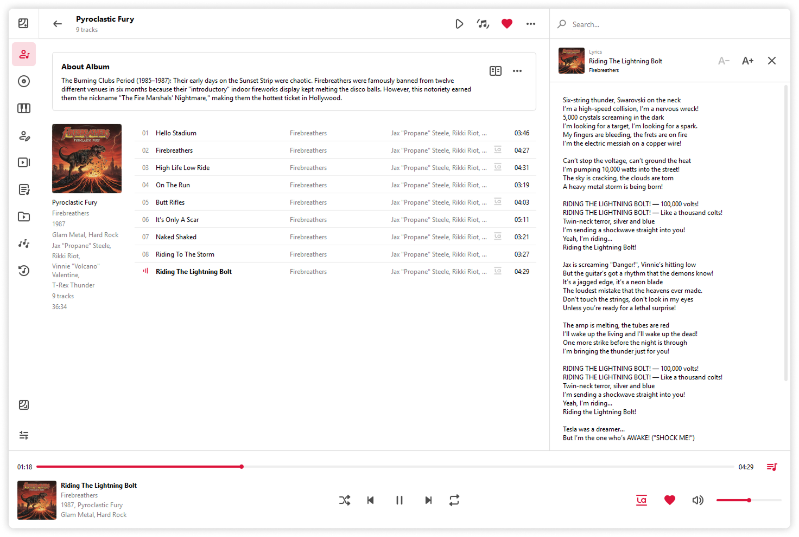](assets/main_wnd/vinyller_artist_albums_album_lyrics.png)

Clicking the lyrics button <kbd>la</kbd> in the control panel or in the track row (or selecting "Show Lyrics" in the track's context menu) switches the queue panel into lyrics viewing mode:
* The panel will display the cover, track title, and artist.
* The <kbd>А-</kbd> and <kbd>А+</kbd> buttons in the header let you decrease or increase the font size for comfortable reading.
* To return to the track list, you must click the <kbd>×</kbd> (Close) button or click the lyrics icon again in the playback control panel.

---

## Context Menu and Actions
The context menu provides quick access to playback controls, library management, and individual tracks. The menu is invoked by right-clicking cards (albums, artists, playlists) or track rows in any section of the program.

[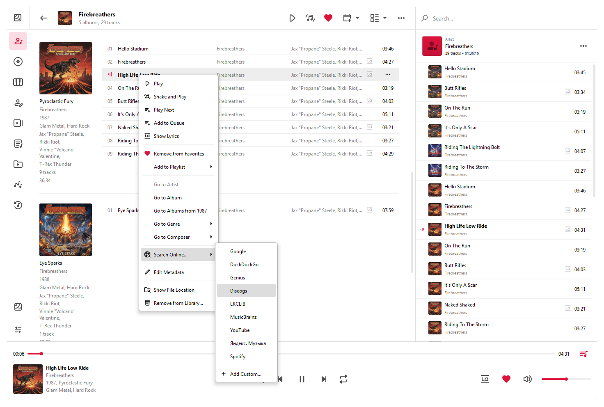](assets/main_wnd/vinyller_artist_albums_context_menu.png)

### Core Actions
Depending on the selected item (track, album, artist, composer, playlist, folder, favorites list, playback history list, etc.), the set of actions may vary slightly, but base functions include:
- **Play:** Replaces the current queue with the selected tracks and immediately starts playback.
- **Shake and Play:** Randomly physically shuffles the tracks of the selected item (e.g., an album or playlist) when adding them to the queue, and begins playback. [*Not equivalent to the `Shuffle mode` function!*](#playback-control-panel)
- **Play Next:** Adds the selected tracks to the queue immediately after the currently playing track.
- **Add to Queue:** Sends the tracks to the very end of the current [playback queue](#playback-queue).
- **Show Lyrics:** Triggers the display of the [song lyrics](#viewing-lyrics) for the selected track (if lyrics exist in the metadata).
- **Reset Rating / Reset month stats:** Available only on the [Charts](#charts-and-rating) tab. Allows you to reset the rating points for an item for the current month or for all time.
- **Add to Favorites / Remove from Favorites:** Adds or removes the item from the [favorites list](#adding-music-to-favorites).
- **Add to Playlist / Remove from Playlist:** Quickly adds or removes an item from saved [playlist](#playlists) files.
- **Go to Artist, Go to Album, Go to Genre, Go to Composer:** Jumps to the corresponding tab and opens the selected entity's page.
- **Go to Albums from `YYYY`:** Jumps to the albums tab, sorts by release date, and auto-scrolls to the selected year.
- **Search Online...:** Calls up a list of available search services; selecting a service opens the corresponding web resource with a search query matching the title of the selected entity.
- **Edit Metadata:** Opens the [universal metadata editor](#metadata-editor) window to change track or album information. Metadata editing is disabled for monolithic FLAC+CUE albums.
- **Open Encyclopedia:** Opens the [encyclopedia](#encyclopedia) window with the article for the selected entity.
- **Show File Location:** Opens your system file manager (Explorer, Finder, etc.) and highlights the corresponding audio file on the disk.
- **Remove from Library...:** Offers removal options: add files to the blacklist (to hide from the interface) or permanently delete the files from your hard drive (including associated `.cue` files for virtual tracks).

A similar list of actions can also be accessed from the top toolbar of the currently open page by clicking the <kbd>...</kbd> button.

### Changing Artist, Composer, or Genre Cover
[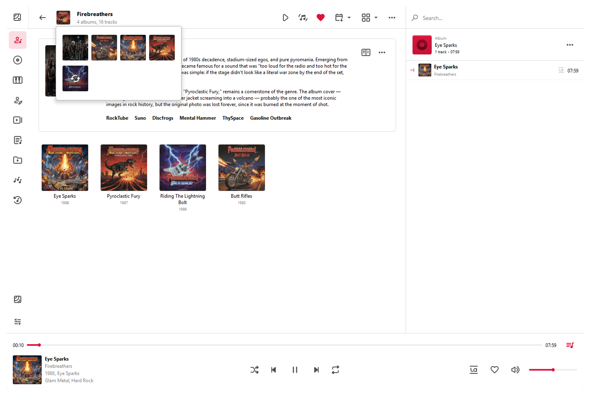](assets/main_wnd/vinyller_artist_replace_cover.png)

Selecting a cover is possible via the top control panel of the current page. To do this, click the cover next to the name of the artist, composer, or genre, and select a new cover from the drop-down menu:
- **From existing:** If the artist, composer, or genre has multiple albums, the main card's cover can be replaced with any of the available ones.
- **Custom cover:** When creating an encyclopedia article for an artist, composer, or genre, you can add a custom cover (for example, a photo of the artist).

### Creating Mixtapes
Vinyller allows you to create physical compilations from your music for use outside the player. This is handy for quickly transferring music to a flash drive, your phone, a car stereo, or the International Space Station without having to manually gather files from across your library.
* In the context menu for playlists, favorite tracks, or directly in the playback queue menu, the **"Create Mixtape"** option is available.
* Selecting it prompts Vinyller to ask for a folder on your computer where all audio files belonging to the selected item will be **copied**, numbered according to their current order in the interface.
* A playlist file will also be generated inside the newly created folder.

### Quick Track Export
If the option allowing file export via drag-and-drop is enabled in the settings, you can drag one or more tracks from the playback queue into any folder on your disk. The tracks will be **copied** as individual files to the selected location.

### Search Services
| Context Menu with Service List | Adding a New Service |
|---------------------------------------------------------------------------------------------------------------------------------|-------------------------------------------------------------------------------------------------------------------------------------|
|  | [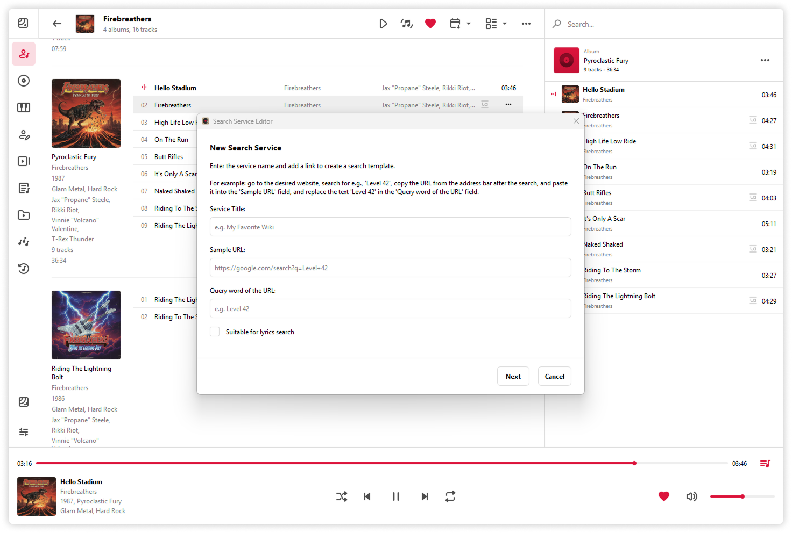](assets/main_wnd/vinyller_artist_albums_search_service.png) |

Integration with search services is provided for quickly finding music information online:
- **Open in browser:** From the context menu of an artist, album, track, etc., you can click once to jump to your internet browser using the chosen service.
- **Custom URLs:** You can add your own search services (e.g., searching Spotify, Apple Music, vinyl record stores, etc.) using the "Add search service" option.
- **Managing Services:** You can disable default services, add or edit custom ones, and configure them for lyrics search in the player's [Settings](#settings) window.

### Drag and Drop into the Program Window

Vinyller supports adding music via drag and drop. When dragging a file into the player window, the interface will display three drop zones:
- **Add to Library:** Dropped files or folders will be added to the player's library;
- **Add to Queue:** Dropped files will be appended to the end of the current playback queue;
- **Replace Queue:** Dropped files will replace the current playback queue entirely.

---

## Player Window Modes
Vinyller has 3 window modes. You can switch between modes using buttons in the interface or the [hotkey](#application-hotkeys) <kbd>C</kbd>.

### Main mode

[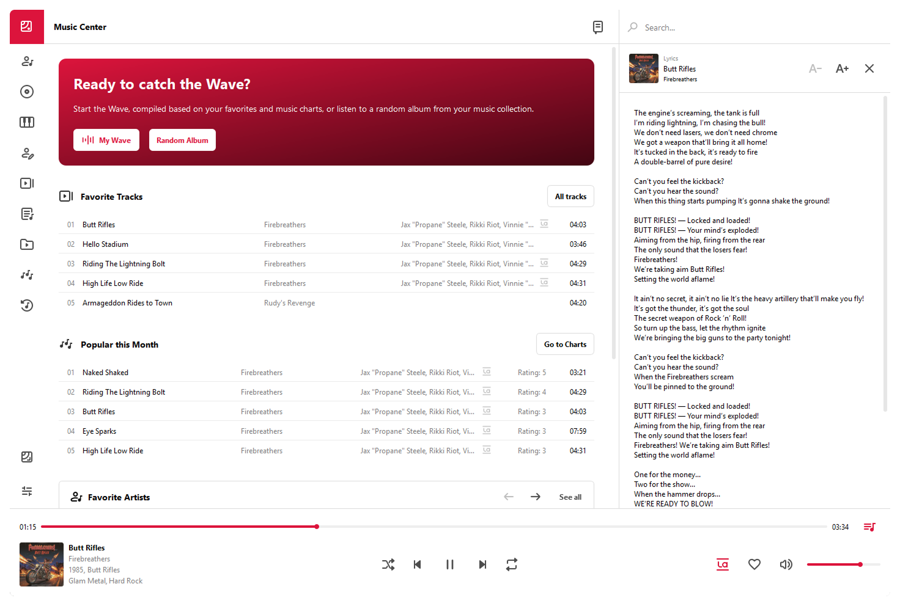](assets/wnd_modes/modes_main.png)

The classic window mode is suitable for full library and playback management. 

Switching between Main mode and Vinyl mode is done using the mode toggle button on the left navigation bar next to the settings button, or via the [hotkey](#application-hotkeys) <kbd>C</kbd>.

### Vinyl mode

[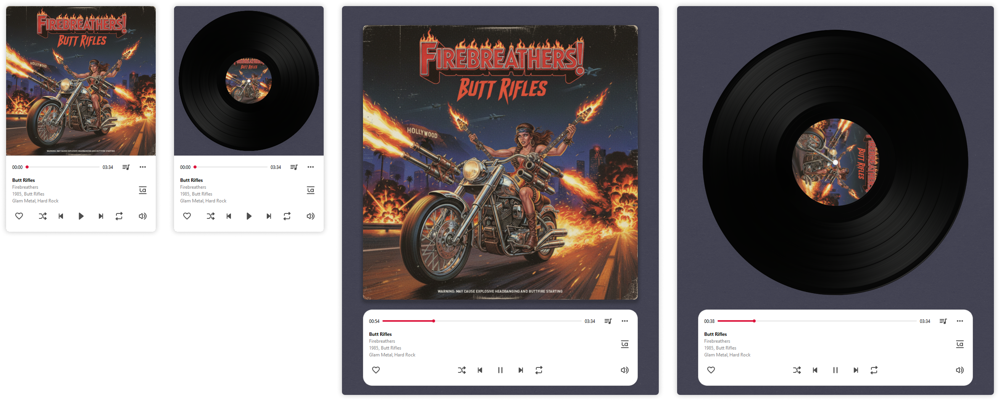](assets/wnd_modes/modes_vinyl.png)

"Vinyl mode" features a visual representation of unpacking and playing a vinyl record. 

- **Unpacking the Record:** Clicking the unpack button (in the top left corner when hovering over the cover area) plays an animation of taking the record out of the sleeve.
- **Always on top:** The window in this mode can be pinned on top of other OS windows by opening the <kbd>...</kbd> actions menu on the playback control panel. Pinning is unavailable on Linux (Wayland, etc.) as the user handles window pinning manually.
- **Resizing:** When you resize the window, the cover and record visualizations, as well as the control panel, adapt to the new window size.
- **Hide control panel:** You can hide the control panel from the <kbd>...</kbd> actions menu.
- **Playback Queue and Lyrics:** Viewing the current [Playback Queue](#playback-queue) and [Lyrics](#viewing-lyrics) is also available in this mode.
- **Stylization:** An option is available in the settings to apply visual styling to covers and records for this mode.

You can return to the Main mode using the button in the top left corner of the visualization, which appears when hovering over the cover art area.

Switching between "Vinyl mode" and "Mini mode" is done from the actions menu in the control panel while in Vinyl mode, or using the [hotkey](#application-hotkeys) <kbd>C</kbd>.

### Mini mode

[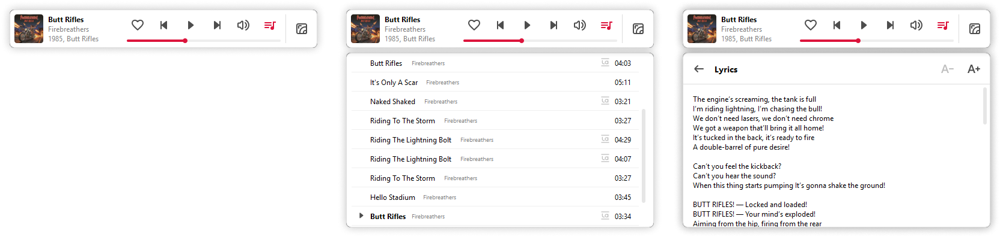](assets/wnd_modes/modes_mini_vinny.png)

"Mini mode" always stays on top of all OS windows. In the program settings, you can enable or disable window transparency for inactive states (i.e., when the window is not in focus) for Windows and macOS. 

- **Playback Queue and Lyrics:** Viewing the current [Playback Queue](#playback-queue) and [Lyrics](#viewing-lyrics) is also available in this mode.
- **Resizing:** You can adjust the height of the playback queue and lyrics block. If the window is pinned to the bottom of the screen, the playback queue block will pop open in the opposite direction.

You can return to "Vinyl mode" using the button on the right side of the window.

Switching between "Mini mode" and Main mode is done using the [hotkey](#application-hotkeys) <kbd>C</kbd>.

---

## Application Hotkeys
Vinyller supports hotkeys, allowing you to quickly switch tracks, adjust volume, and control the interface without using a mouse. Below is the full list of available shortcuts:

### Playback Control
- **Play / Pause:** <kbd>Space</kbd>
- **Next Track:** <kbd>F</kbd> or <kbd>Ctrl</kbd> + <kbd>→</kbd> (Right Arrow)
- **Previous Track:** <kbd>B</kbd> or <kbd>Ctrl</kbd> + <kbd>←</kbd> (Left Arrow)
- **Seek to X% of track:** Combinations from <kbd>Ctrl</kbd> + <kbd>0</kbd> to <kbd>Ctrl</kbd> + <kbd>9</kbd> instantly jump to a specific percentage of the track's duration (where 0 is the beginning or 0%, 1 is 10%, and 9 is 90% of the track).

### Sound and Mode Control
- **Increase Volume:** <kbd>+</kbd>, <kbd>=</kbd>, or <kbd>Ctrl</kbd> + <kbd>↑</kbd> (volume increases by 5%).
- **Decrease Volume:** <kbd>-</kbd> or <kbd>Ctrl</kbd> + <kbd>↓</kbd> (volume decreases by 5%).
- **Mute / Unmute:** <kbd>M</kbd>
- **Toggle Shuffle:** <kbd>S</kbd>
- **Cycle Repeat Mode:** <kbd>R</kbd>

### Navigation and Interface
- **Cycle window modes:** <kbd>C</kbd> lets you quickly toggle between Main mode, Vinyl mode, and Mini mode.
- **Toggle Favorite:** <kbd>L</kbd> adds or removes the current track from your favorites list.
- **Focus Search Field:** <kbd>Ctrl</kbd> + <kbd>F</kbd> instantly places the cursor in the global search bar; if "Vinyl mode" was open, Vinyller automatically returns to the main library interface.
- **Open Settings:** <kbd>P</kbd>

---

# Metadata and Encyclopedia

This section describes the main capabilities for managing Vinyller's metadata and encyclopedia.

## Metadata Editor
Vinyller features a built-in universal tag editor that allows you to modify audio file metadata (ID3, Vorbis Comments, MP4, ASF) individually or in batch mode. The editor can be summoned from the context menu of a track, album, folder, or a selected group of files **in the playback queue list**. Metadata editing is powered by the [Mutagen](https://github.com/quodlibet/mutagen) library.
- Upon saving, Vinyller will display a summary table of modifications and ask you to "Check Changes".
- The Artist, Composer, and Genre fields support lists — you must use a semicolon <kbd>;</kbd> to input multiple values, e.g., `Artist A; Artist B`. Vinyller correctly parses the list and allows quick navigation to each distinct value from track lists, album cards, and the playback control panel. 

### Single Track Editor Mode

[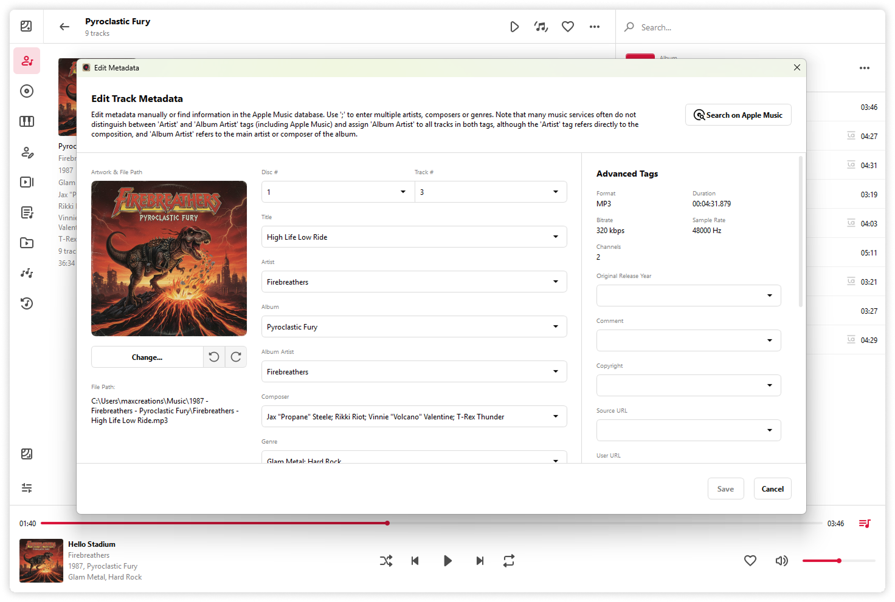](assets/meta_edit/metaedit_single_track.png)

When editing a single file, a form is displayed consisting of:
- **Cover Art:** Allows you to pick any image ("Change..." button). If you are unhappy with the result, reset and replace buttons are available. 
- **Basic Tags:** Fundamental fields such as Title, Artist, Album, Genre, Year, as well as track and disc numbers. Auto-completion based on your library works for genres and artists.
- **Lyrics:** Allows manual insertion of song lyrics (formatting is automatically stripped of HTML tags when pasted). 
  - **<kbd>Search Online...</kbd> Button** — lets you choose a [Search Service](#search-services) and opens your browser with the query `Lyrics {artist_title} {track_title}`.
  - **<kbd>Download from LRCLIB</kbd> Button** — allows automatic finding and downloading of lyrics based on the current track title and artist specified in the form, provided the lyrics are available in the LRCLIB database.
- **Advanced Tags:** Contains technical info (format, bitrate, sample rate) and extended tags (BPM, ISRC, Copyright, User URL, etc.).
  * _Note: The list of available advanced fields dynamically changes depending on the source file format (MP3, FLAC, MP4). Some tags are strictly read-only._

### Edit Album Metadata Mode

[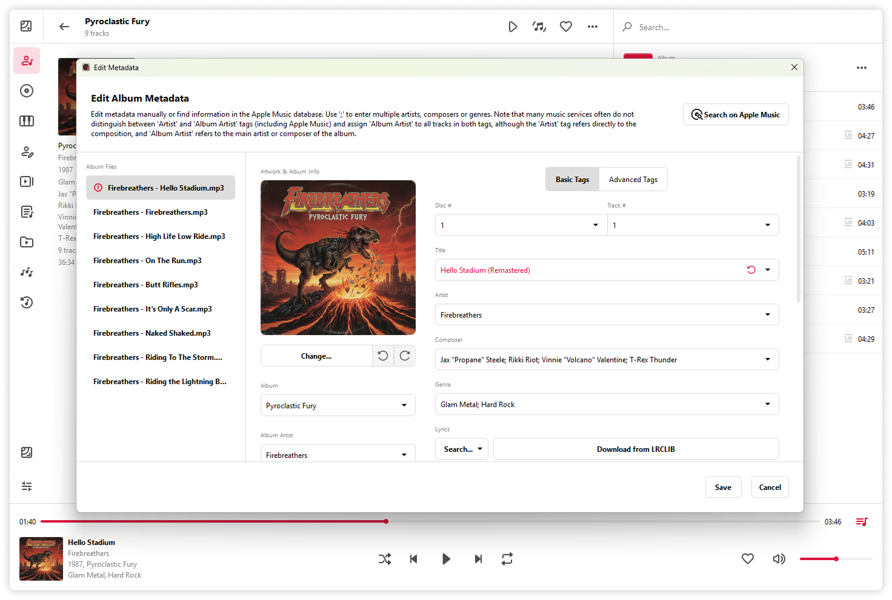](assets/meta_edit/metaedit_album.png)

If you initiate metadata editing for an album, the editor opens in a batch mode consisting of the following blocks:
- **Album Files:** Contains all tracks of the selected album. A warning icon indicates which files have been modified. You can right-click a file in the list to open its context menu and jump to the folder containing it.
- **Artwork & Album Info Block:**
  - **Global Tags:** Fields shared across the entire album — Cover Art, Album, Album Artist, and Year. 
- **File Tag List:**
  - **"Basic Tags" Tab:** Fundamental fields like Title, Artist, Album, Genre, Year, as well as track and disc numbers. Auto-completion based on library data works for genres and artists.
    - **<kbd>Search Online...</kbd> Button** — lets you select a [Search Service](#search-services) and opens a browser with the query `Lyrics {artist_title} {track_title}`.
    - **<kbd>Download from LRCLIB</kbd> Button** — allows automatic finding and downloading of lyrics based on the current track title and artist in the form for the track being edited, if available on LRCLIB.
  - **"Advanced Tags" Tab:** Contains technical information (format, bitrate, sample rate) and extended tags (BPM, ISRC, Copyright, User URL, etc.).
    * *Note: The list of available advanced fields dynamically changes depending on the source file format (MP3, FLAC, MP4). Some tags remain read-only.*
- **Multi-Edit Mode:** Highlighting several tracks in the file list enables "Multi-Edit Mode". If tag values across selected tracks differ, a `<Different Values>` placeholder will appear. Values entered in this mode will be applied to all highlighted files.

### Edit Multiple Files Metadata Mode

[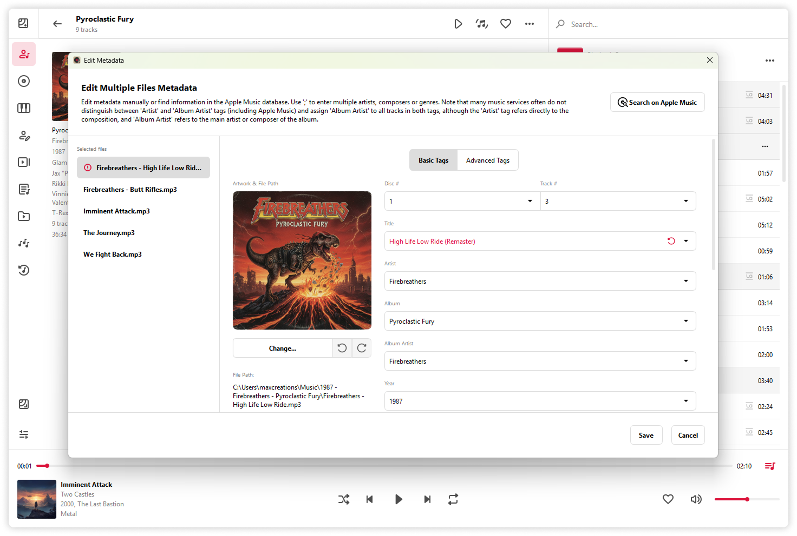](assets/meta_edit/metaedit_multi_track.png)

The metadata editor for multiple files that **do not belong** to a single album can be invoked: 
- From the context menu of a folder (on the "[Folders](#folders)" tab). 
- From the context menu when multiple tracks are selected in the [Playback Queue](#playback-queue).
 
If triggered for multiple files, the editor opens in a batch mode consisting of these blocks:
- **Selected files:** Contains all highlighted tracks. A warning icon indicates which files have modifications. Right-clicking a file reveals a context menu to show its folder location.
- **"Basic Tags" Tab:** - **Artwork & File Path:** Pick any image ("Change..." button). Undo/redo options are available if you don't like the new art. 
  - **Global Tags:** Basic fields such as Title, Artist, Album, Genre, Year, as well as track and disc numbers.
  - **Lyrics:**
      - **<kbd>Search Online...</kbd> Button** — lets you select a [Search Service](#search-services) and opens a browser with the query `Lyrics {artist_title} {track_title}`.
      - **<kbd>Download from LRCLIB</kbd> Button** — automatically fetches lyrics using the track and artist names in the form for the currently selected file.
- **"Advanced Tags" Tab:** Contains technical info (format, bitrate, sample rate) and extended tags (BPM, ISRC, Copyright, User URL, etc.).
  * *Note: Available fields depend on the file format (MP3, FLAC, MP4). Some remain read-only.*
- **Multi-Edit Mode:** Highlighting multiple tracks enables "Multi-Edit Mode". Differing tag values show a `<Different Values>` placeholder. Entered values are written to all selected files.

### Search on Apple Music Integration
At the top of the editor sits the **"Search on Apple Music"** button, designed for automatic metadata hunting and populating:
1. When invoked, it auto-fills the search query with current form values and displays results.
2. Upon confirming a choice, the player automatically downloads the album art and fetches the entire tracklist for that album.
3. **Apple Music Match:** Vinyller will attempt to automatically link your local files with the Apple Music tracks based on similarities in titles or track numbers. You can also manually assign the correct track from the dropdown — all fields (Title, Track #, etc.) will populate instantly.

### Saving Changes
Before permanently writing data to files, Vinyller will show a "Check Changes" prompt:
- **Modification Table:** A list visually demonstrating what the value was before editing and what it will become after saving. 
- **Fast Save:** The "Fast Save" option is available when editing individual tracks. It writes the changes to the files on disk but defers the visual interface update and library cache rebuild.

---

## Encyclopedia
Vinyller's built-in music encyclopedia allows you to create, store, and organize information about your favorite artists, albums, genres, and composers. All data and images are stored locally, forming your personal knowledge base, tightly integrated with the player's library.

### Encyclopedia Manager Window

[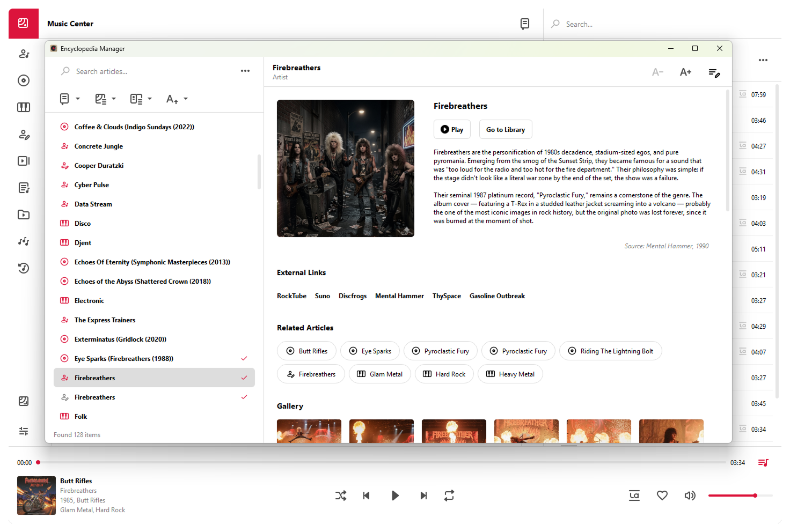](assets/encyclopedia/ency_main_wnd.png)

Access to manage your knowledge base is done via the **Encyclopedia Manager** (invoked from [context menus](#context-menu-and-actions) or the top control panel of the "[Music Center](#music-center)" tab). The window is split into two primary panels:

* **Left Panel (Navigation and Search):** Features a search bar and a list of all available entities (both those added to the encyclopedia and those simply existing in your local library). 
  * **Filters:** You can "Filter by Type" (Artists, Albums, Genres, Composers), "Filter by Status" (Filled Only, Empty Only), and "Filter by Availability" (In Library / Missing).
  * **Sort Options:** Sorting is available alphabetically and by Date Modified.
  * The color indication of icons in the list tells you whether the item is bound to actual audio files on your drive (accent color) or only exists as a textual article (gray).
* **Right Panel (View and Read):** Selecting an item from the list opens the full article card with its cover, description, links, and gallery. At the top of the panel are navigation buttons (Back), font sizing for comfortable reading (<kbd>A-</kbd> / <kbd>A+</kbd>), and an "Edit" button. 

Via the <kbd>...</kbd> menu button next to the search bar, you can create a "New Article" from scratch (through a setup dialog to define type and basics), and access the [export/import features](#import-export-and-encyclopedia-backups).

### Adding and Editing an Article

[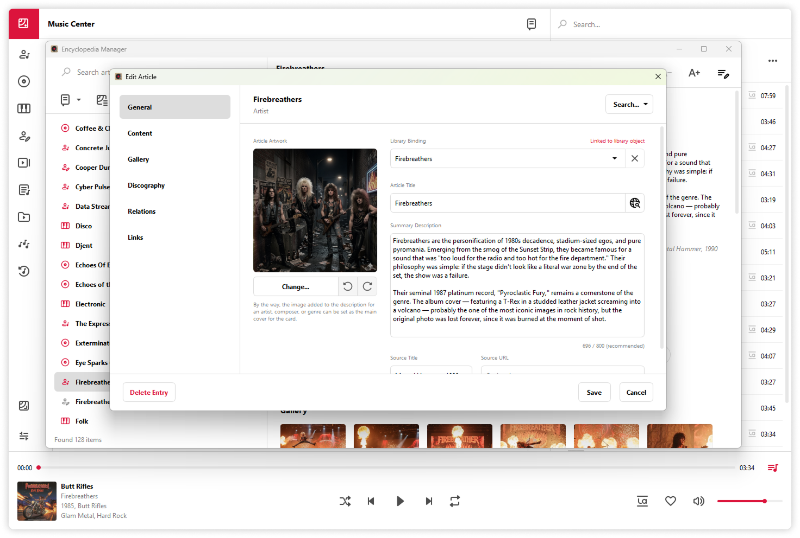](assets/encyclopedia/ency_main_edit_article.png)

You can launch the article editor from the Encyclopedia Manager or the [Context Menu](#context-menu-and-actions) of an artist, composer, album, or genre in the main player window. The editor features several tabs:

1. **General:** * **Library Binding:** A crucial feature allowing you to connect a text article with a physical object in your library (e.g., a specific album). When bound, article metadata (year, genre, members) fills automatically. Furthermore, the bound object in the main player UI will now display an inset block containing encyclopedia data.
   * **Title and Article Artwork:** Sets the primary image. This image can be used [to set the main cover](#changing-artist-composer-or-genre-cover) for library cards in the main player window.
   * **Search Wikipedia:** The magnifying glass button automatically searches Wikipedia (with language selection) to instantly fetch a "Summary Description" and the main cover photograph.
   * **Summary Description:** A text box for core information (recommended up to 800 characters, as this text shows up in compact overview blocks in the main UI).
2. **Content:** Allows adding "New Block" sections (e.g., "Early Years", "Critical Reception", "Awards"). Each block has its own title, source, and supports text formatting (bold, italic, lists). Blocks can be reordered using the "Move up" / "Move down" arrows.
3. **Gallery:** Add additional photos, booklet scans, or promotional material here. A text "Caption" can be added to every image.
   * Note: All added images are automatically optimized and cached in the player's system folder. If originals are deleted or moved, one click on **"Clear inaccessible files"** purges broken links.
4. **Discography:** Available for Artists and Composers to build a release list. You can use the **"Auto Find"** button to automatically pull in all related albums from your local library or manually "Add Album". *If you alter tags (e.g., rename an album), Vinyller detects this and offers to "Migrate Articles" to the new name.*
5. **Relations:** Allows linking articles to one another for fast cross-navigation. 
   * The **"Auto Find"** button analyzes your music metadata to suggest linking genres, composers, and other logically associated elements.
   * **"Interlink All"** establishes two-way connections between all listed items, whereas **"Break Interlinks"** mass-removes them.
6. **Links:** For attaching "External Links" (official sites, streaming platforms, online stores). If "Link Title" is left blank, a title is auto-generated based on the domain when adding the URL.

### Viewing an Article
[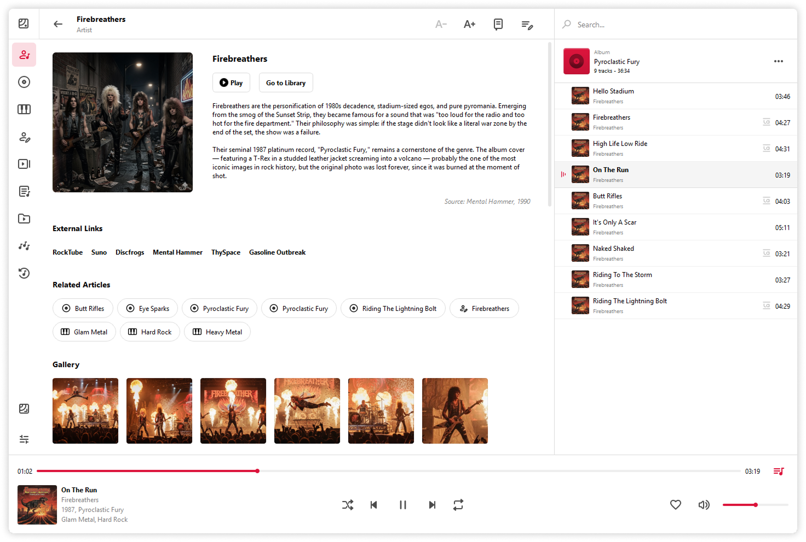](assets/encyclopedia/ency_artist_full.png)

Aside from the encyclopedia manager, entries display directly inside the library browsing interface:
* **Compact Block:** At the very top of artist, album, or genre pages sits a compact card containing the summary description. You can "Expand" or "Collapse" this block.
* **Full-Screen View:** Clicking "Read More" opens the detailed article page.
* **Interactive Elements:** * Clicking items under "Related Articles" triggers a quick jump to them. If an article doesn't exist yet, Vinyller prompts to create it, auto-filling known metadata.
  * The "Discography" block shows **collection stats** (e.g., "Collected 5 of 10"). Album cards are interactive: if the album is in the library, its [context menu](#context-menu-and-actions) allows you to **Play** or queue it immediately. If it's absent, the card carries an "Encyclopedia Only" label.
  * Gallery thumbnails can be clicked to enlarge them into a full-screen slideshow mode.

### Import, Export and Encyclopedia Backups
[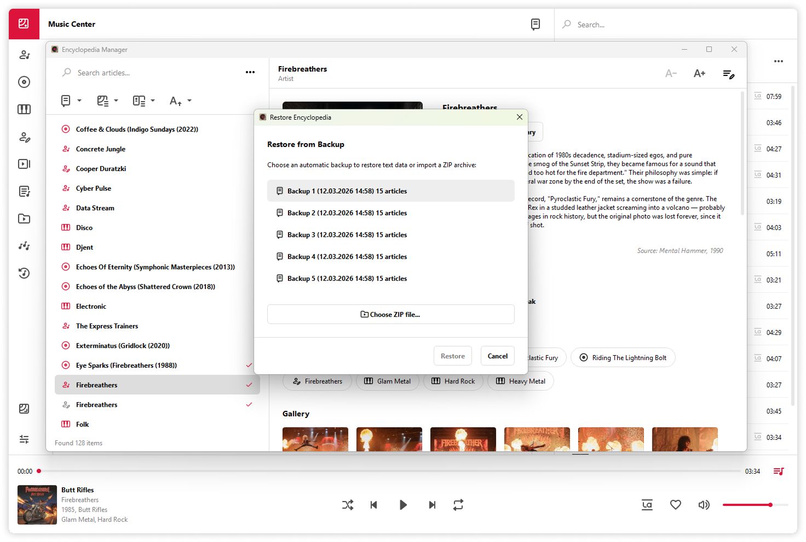](assets/encyclopedia/ency_main_import_restore.png)

Because the encyclopedia is curated manually, Vinyller offers robust mechanisms to protect your data:

* **Automatic Backups:** Vinyller automatically creates and rotates up to 5 recent backups of the text database (`encyclopedia.json.bak`). If you accidentally mangle or delete a critical article, you can revert state via the Encyclopedia Manager (<kbd>...</kbd> -> Import -> select from automatic backups) or the [Settings](#settings) window.
* **Export Encyclopedia:** Packs your entire encyclopedia (including all fetched images, gallery covers, and texts) into a single ZIP archive. An excellent way to migrate the database to a new PC or maintain a reliable manual backup.
* **Import Encyclopedia:** Lets you "Restore from Backup" (automatic files) or import an encyclopedia previously saved to a ZIP archive.
* **Global Cleanup:** Under the "Encyclopedia" tab in the [Settings](#settings), an "Encyclopedia Cleanup" feature exists. The app scans the image folder and deletes any "unused images" no longer referenced by any article.

#### Resolving Encyclopedia Import Conflicts

[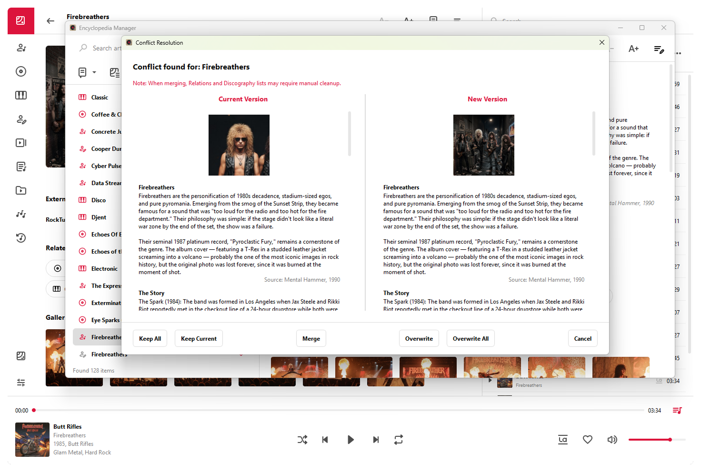](assets/encyclopedia/ency_main_import_compare.png)

When importing a previously exported archive, Vinyller evaluates its contents. If identical articles exist in your current database, Vinyller presents "Conflict Resolution" strategies: **Overwrite All**, **Keep All** (skip duplicates), **Merge**, or launch an interactive mode where you manually "Confirm" each change by comparing the "Current Version" against the "New Version".

--- 

# Settings and Processes

This section describes Vinyller's main configuration options and background processes.

## Settings

The settings window is divided into tabs designed to tweak interface parameters, behavioral logic, and local library management. You can summon the settings from the side navigation bar or by pressing the <kbd>P</kbd> hotkey.

### General settings
[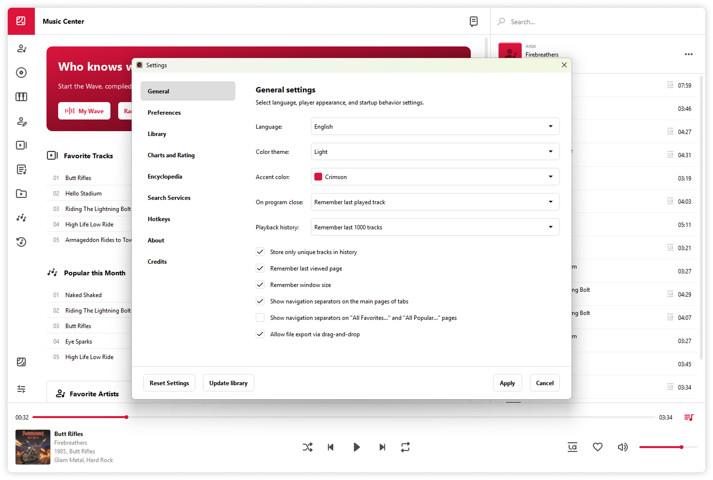](assets/settings/settings_general.png)

This section dictates UI parameters, language choices, and session state persistence:

- **Language:** UI language selection. "Restart Required".
- **Color theme and Accent color:**
  * Interface visual theme selection. "Restart Required".
  * UI accent color selection. "Restart Required".
- **On program close:** * "Do not remember queue";
  * "Remember queue";
  * "Remember last played track";
  * "Remember track position".
- **Playback history state between sessions:**
  * "Do not remember history";
  * "Remember for current session";
  * "Remember last 1000 tracks";
  * "Store only unique tracks in history" option.
- **Interface and windows:** Toggles to "Remember last viewed page" upon restart and "Remember window size" for both Main and Vinyl modes.
- **Navigation separators:** Toggles to "Show navigation separators on the main pages of tabs" and inside favorites/popular sections.
- **File export:** Toggles "Allow file export via drag-and-drop" from the playback queue directly to file system folders.
- **Check for updates at startup:** Automatically checks for new versions of Vinyller on GitHub when the program starts. If a new version is detected, a corresponding message will appear in the notification area of the main window.

#### Changing the Color theme and Accent color
| Light | Retro Light | Retro Dark | Graphite | Polar Night | Dark |                                                                                                                                     
|-------------------------------------------------------------------------------------------|-----------------------------------------------------------------------------------------------------------|-----------------------------------------------------------------------------------------------------------|-----------------------------------------------------------------------------------------------------------|-----------------------------------------------------------------------------------------------------------|-----------------------------------------------------------------------------------------------------------|
|  | [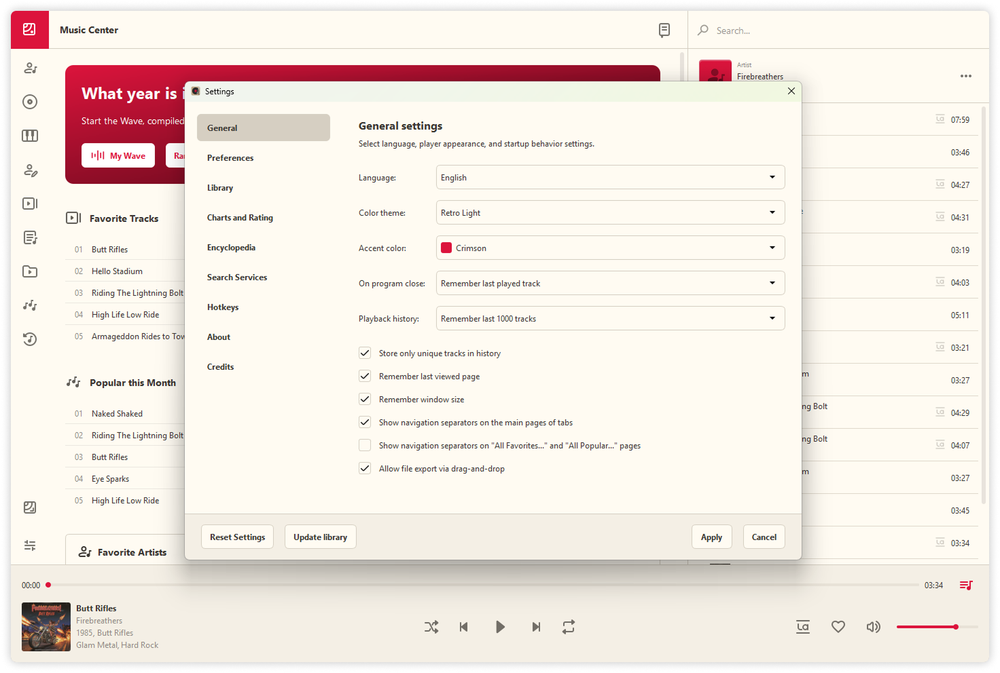](assets/settings/settings_general_theme_1.png) | [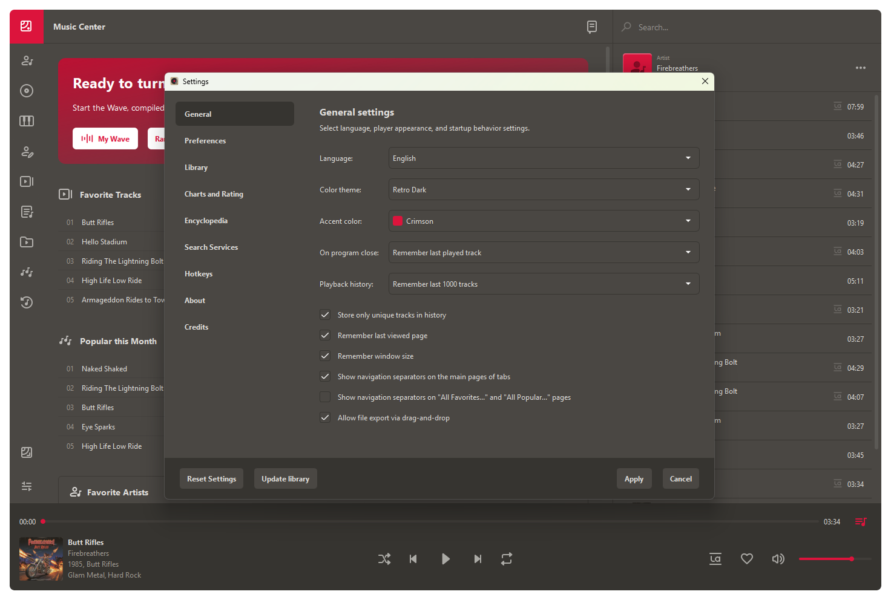](assets/settings/settings_general_theme_2.png) |  | [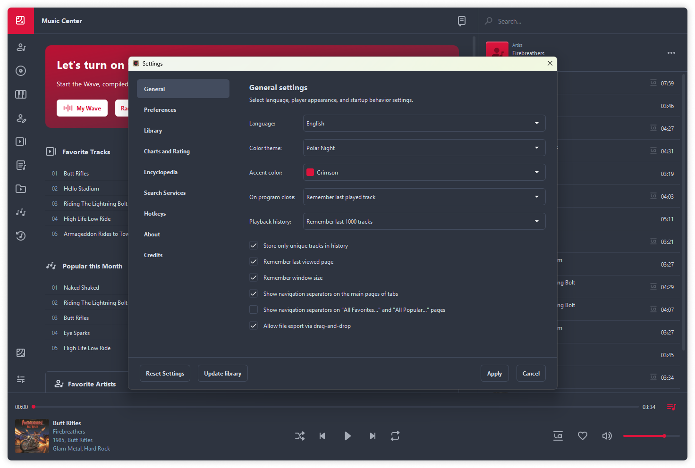](assets/settings/settings_general_theme_4.png) | [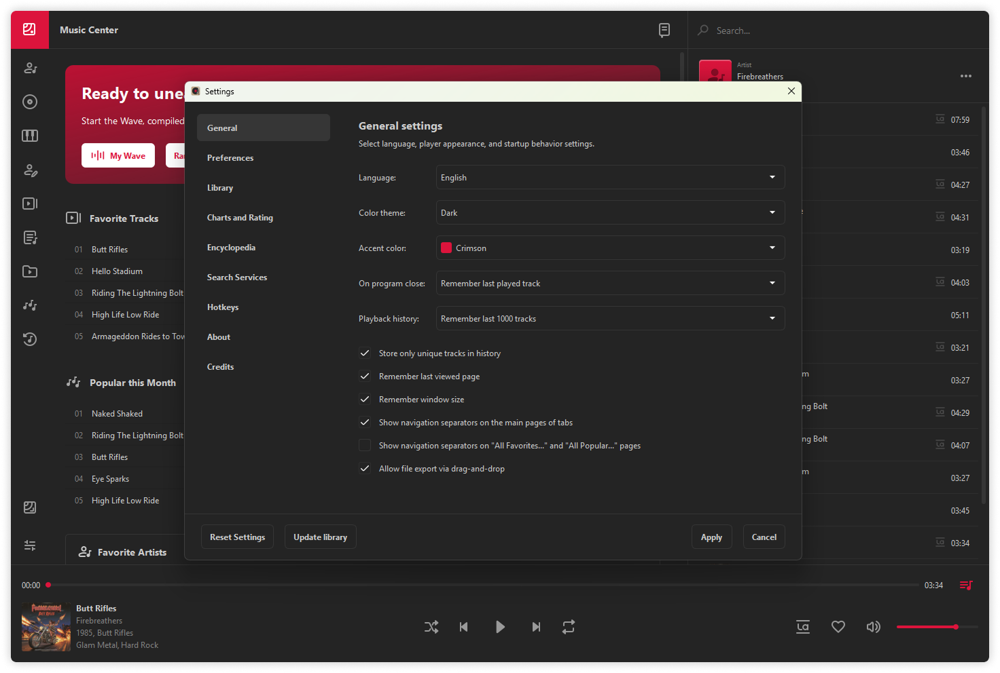](assets/settings/settings_general_theme_5.png) |

Various visual themes and a host of predefined accent colors are available to pick from.

#### Color Picker (Custom Color)

Selecting "Custom color..." from the accent color menu displays a HEX code button. 
Clicking it summons a color palette to define arbitrary control colors, keeping in mind the contrast ratios necessary for the current visual theme. 

### Preferences
[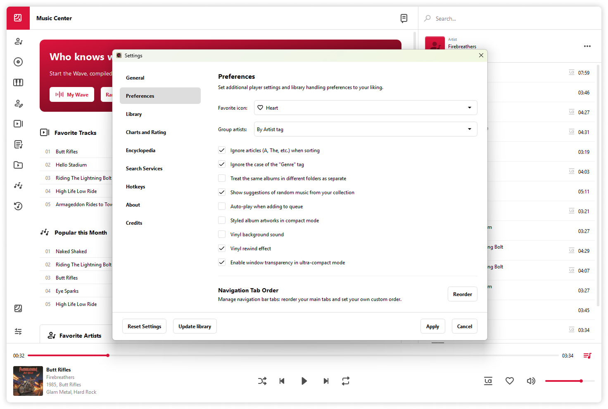](assets/settings/settings_preferences.png)

Controls logic regarding sorting, playback, and navigation:

- **Favorite icon:** Graphic symbol choice for the favorites button.
- **Group artists:** Chooses the tag for assembling the artist list (`By Artist tag` or `By Album Artist tag`). Navigation methods will adapt based on this. Requires a library rescan.
- **Ignore articles (A, The, etc.) when sorting:** Omits articles in alphabetical sorting. The list is defined as `ARTICLES_TO_IGNORE` and includes `the, a, an, der, die, das, ein, eine, el, la, los, las, un, una, unos, unas, o, os, as, um, uma, uns, umas, le, les, une, des, il, lo, gli, uno, de, het, een, en, ett, den, det`. 
- **Ignore the case of the "Genre" tag:** Merges differently cased genres into a single entity (e.g., rock, ROCK, and rOcK become Rock).
- **Treat the same albums in different folders as separate:** If checked, albums bearing identical titles and artists but sitting in disparate directories act as separate releases (appearing with disc icons and sequence numbers).
- **Show suggestions of random music from your collection:** Enables a recommendation block on library tabs, provided the tab has over 20 items.
- **Auto-play when adding to queue:** Begins playback when adding a track to a completely empty queue.
- **Styled album artworks in Vinyl mode:** Overlays a texture onto album covers in [Vinyl mode](#vinyl-mode).
- **Sound effects:** Enables "Vinyl background sound" (across all modes) and the "Vinyl rewind effect" (record scratch noise when seeking in Vinyl mode).
- **Enable window transparency in Mini mode:** Activates translucency for an unfocused window in [Mini mode](#mini-mode). Unavailable on Linux (Wayland, etc.) as the user manages window pinning and composition manually.

#### Reorder Navigation Tab Order
The "Reorder" button triggers a dialog to arrange the sequence of the side navigation menu items. Reordering the tabs will correspondingly shift the content blocks inside the ["Music Center"](#music-center) tab.

### Library
| Library | Blacklist | Unavailable Favorites |
|-------------------------------------------------------------------------------------------|---------------------------------------------------------------------------------------------------------------|---------------------------------------------------------------------------------------------------------------------------------|
| [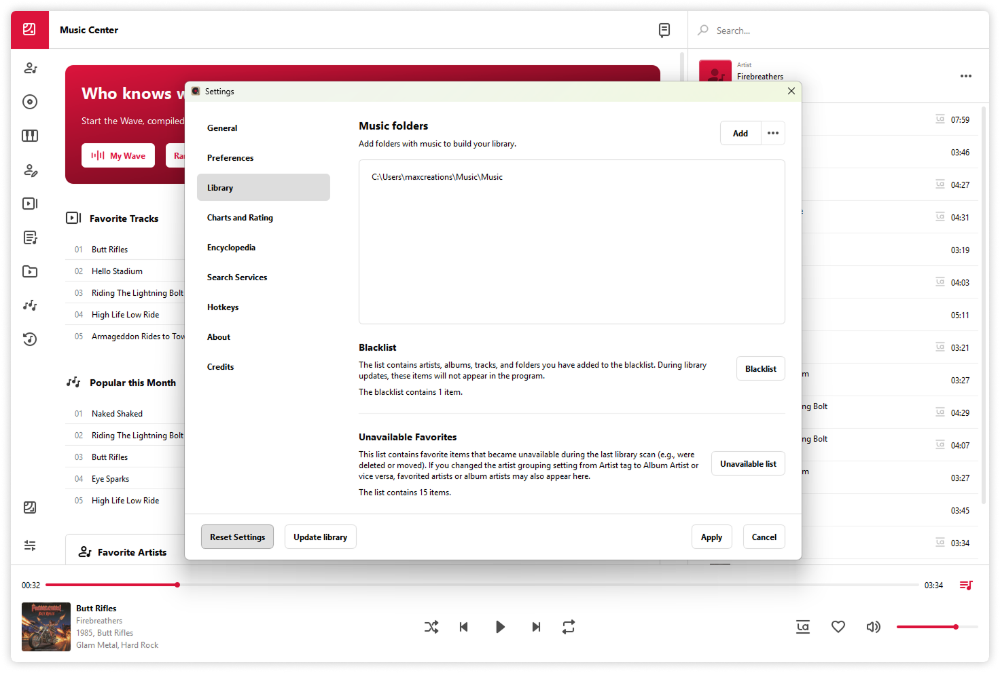](assets/settings/settings_library.png) | [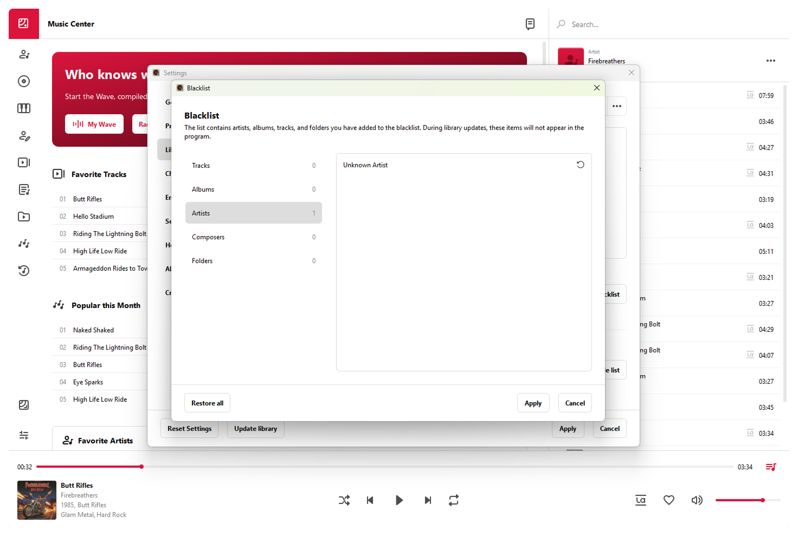](assets/settings/settings_library_blacklist.png) |  |
Manages directories and exclusion lists:
- **Music folders:** Adding and removing directories to be scanned. The "Optimize Path List" function scrubs nested subfolders if the parent directory is already targeted.
- **Manage blacklist:** A dialog window addressing excluded tracks, albums, artists, composers, genres, and paths. A library rescan is required after applying changes.
- **Unavailable Favorites:** Manages the [favorites list](#unavailable-favorites) elements whose physical files were relocated or deleted.

### Charts and Rating
[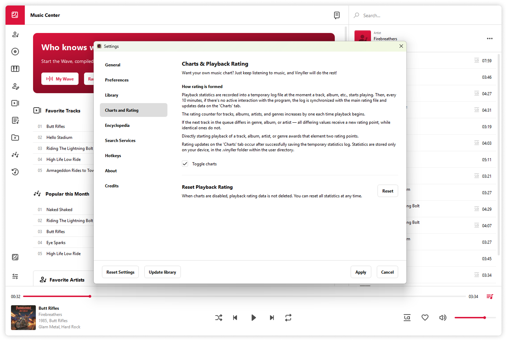](assets/settings/settings_charts.png)
Configuration for the statistics system:
- **Toggle charts:** Enables or halts tracking [playback rating](#charts-and-rating) data.
- **Reset rating:** Zeroes out compiled statistics and scores.

### Encyclopedia
[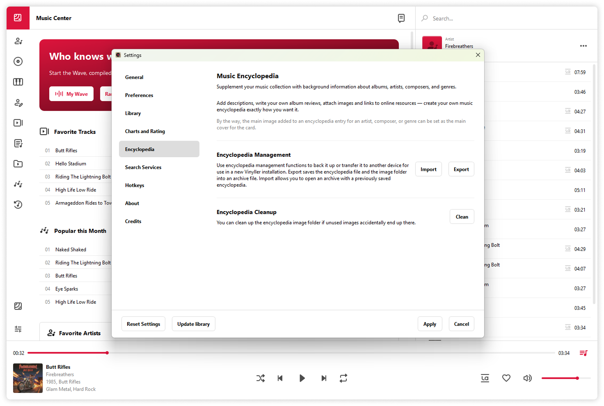](assets/settings/settings_encyclopedia.png)
Administration of the local encyclopedia database:
- **Encyclopedia Management:** "Import encyclopedia" and "Export encyclopedia" archive functions (includes attached imagery).
- **Encyclopedia Cleanup:** Scans and removes unused images lingering in the encyclopedia directory that are unbound to any article.

### Search Services
[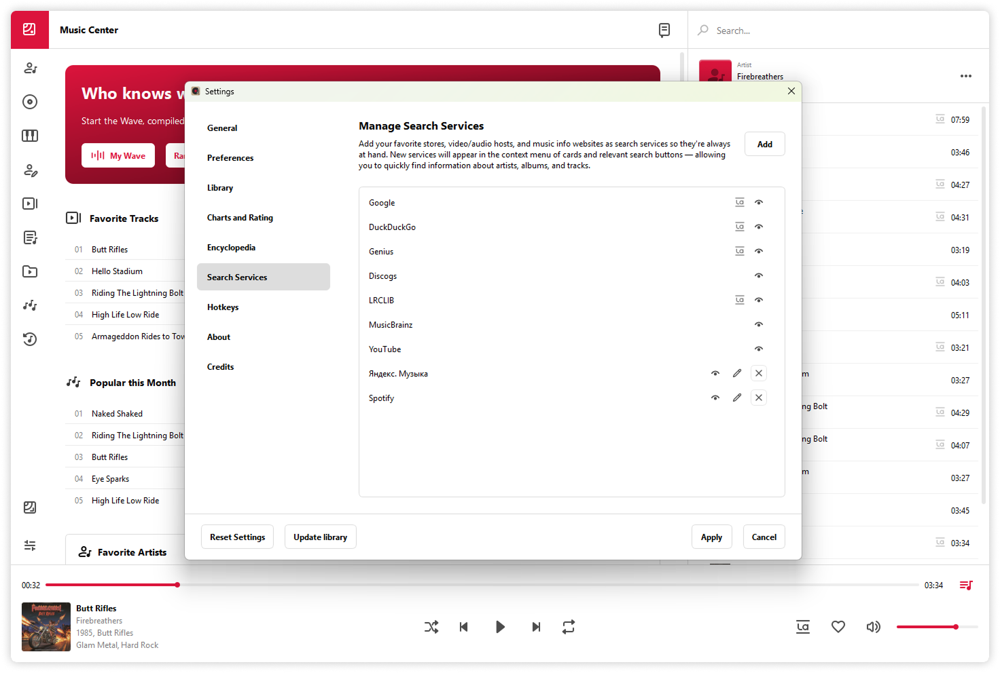](assets/settings/settings_search_services.png)
Setup for integration with external search platforms:
- **Add search service:** Creates custom search templates specifying if they support lyrics search.
- **Manage Search Services:** Toggles visibility for default and custom services in the context menu. You can also edit and delete custom entries.

## Processes

### Updating the Library
The process of scanning and updating your music database runs in an isolated background thread, ensuring the player interface stays responsive. 
- When an update launches, the software traverses all listed music folders searching for supported audio files.
- Metadata extraction (tags, covers, duration) relies on the [Mutagen](https://github.com/quodlibet/mutagen) library.
- Blacklist rules apply during processing: files, folders, or entities defined in the exclusions list are ignored and skip the database entirely.
- Post-read, tracks are dynamically grouped into artists, albums, genres, and composers.
- Final scan results get written into a local cache file.

### Startup Library Modification Check
Vinyller detects external alterations in monitored music directories (e.g., a new album dropped into a tracked folder, or an external tag editor touched some files).
- After UI initialization, a background modification check fires up.
- It compares physical file metrics (size and last modified timestamps) against a cached footprint of the library structure.
- If it pinpoints new, altered, or deleted files, it tallies them and triggers a popup "Library update required" notification.
- Confirming the update invokes a "Smart Update", which surgically processes only the flagged files without wasting time rebuilding the entire library.

### Splitting Albums into Discs
The player enforces the correct playback sequence for multi-disc editions.
- While reading metadata, Vinyller pulls disc number info from respective tags (e.g., `discnumber`, `TPOS`, `disk`), adeptly handling fractions like "1/2".
- When populating the tracklist inside an album, tracks are dual-sorted: primarily by disc number, then sequentially by track number.

### Parsing Monolithic FLAC+CUE Albums
Vinyller natively supports unified audio files (disc images) paired with a `.cue` index sheet.
- During directory scans, the app hunts down `.cue` files and dissects them.
- The parser tolerates multiple encodings (`utf-8`, `cp1251`, `latin1`), guaranteeing clean reads of localized or legacy markup files.
- It extracts global album data alongside metrics for individual tracks: title, artist, composer, precise `start_ms`, and `duration_ms`.
- These parsed components are injected into the library as "virtual tracks" (`is_virtual`).
- Virtual tracks point back to the solitary physical audio file, but they act, render, and queue up as totally distinct entities in the interface.
- You can add virtual tracks to favorites just like conventional files.
- Virtual tracks are fully participating members in [chart generation](#charts-and-rating).
- Monolithic albums are fenced off from [metadata editing](#metadata-editor) to preserve the album structure exactly as ripped.

### Caching External Tracks
Vinyller spins up a specialized cache (`external_tracks_cache.json`) for audio tracks residing **outside the primary library folders** monitored by the app. This mechanism serves a few vital roles:
- **Playlist Handling:** When loading or indexing playlists (`.m3u` / `.m3u8`) holding references to unmanaged files, the app rips their metadata and stows it in the cache for instant recall.
- **Restoring Playback Queue:** On reboot, Vinyller instantaneously reconstructs the prior session's queue, deferring to the external cache if queued files sit outside the core library.
- **Performance Optimization:** Direct raw tag extraction (title, artist, duration, cover) from audio files is expensive. Caching allows blazing-fast data injection upon subsequent access.
- **Relevance Tracking:** Whenever polling the cache, the program checks the physical external file's modified timestamp against the database record. If a third-party app tweaked the file, metadata is rescraped and the cache updates seamlessly.

---

## Adding New Localizations
Vinyller ships in 18 languages and welcomes new translations. 

### Requirements
* **Flag Icon:** An image formatted as `.png`, `.svg`, or `.jpg`, sized exactly `width: 48px; height: 36px`.
* **Translation File:** Translate one of the existing translation files.

#### Note
Inside translation files, beneath the `# --- Other / Dynamic / Not found in source files ---` header, you'll find keys and values that:
- Generate dynamically inside loops;
- Are passed into the `translate` function as variables;
- **OR** were simply **not found** in the source codebase.

### Tools
* **Translation management file `utils_translator`:** Pre-equipped to handle pluralization rules for major European and Asian languages.
* **Verification file `_update_translations`:** Verifies the presence of translations for **all** keys **relative to the entire codebase**, injecting missing strings as commented stubs.
* **Verification file `_check_line_breaks`:** Scans for HTML tags and line breaks (e.g., `\n`, `\\n`, ` `, ` `, ` `) in translations **relative to their keys**, appending warnings to malformed lines.
* **Verification file `_check_line_breaks_by_ref`:** Validates line breaks and tags in translations **relative to a "reference" localization file** (defaulting to `en.py`), flagging discrepancies.
* **Testing file `_test_translations`:** Asserts that translations match the required plural forms enumerated in `utils_translator`. Additionally, the script strictly enforces the retention of **formatting variables** (like `{count}`) — if a variable in a key is dropped in translation, the test will halt with an error. Optionally, you can enable format marker verification relative to the reference file (`en.py`).

### Procedure
1. **Check Compatibility:** Verify that the incoming language aligns with current pluralization logic. If required, graft new plural conditions into **both** methods inside `utils_translator`: `get_expected_plural_count` (for test validation) and `_get_plural_form` (for proper rendering in the app).
2. **Localization File:** Drop the new translation dictionary into the `translations` directory. Naming must abide by the IETF standard, using lowercase formatting and underscores (e.g., `pt_br.py`).
3. **Execute Prelim Checks:** Run all validation tools ([see Tools section above](#tools)).
4. **Post-Validation:** Rerun `_update_translations` to sweep away redundant comments and standardize the file formatting.
5. **Add Flag Icon:** Place the flag image into the `assets/flags/` directory.
6. **Add to Catalog:** Insert the new language into the dictionary inside the **constants** file, e.g., `"Português do Brasil": ("pt_br", "assets/flags/br.png")`. _For the language name, use the **native name of the language**; for the language code, stick to **IETF/ISO 639** with lowercase underscores; for the flag image filename, use **ISO 3166**._
7. **Test:** Verify that the language correctly applies within the settings window and renders error-free throughout the user interface.
